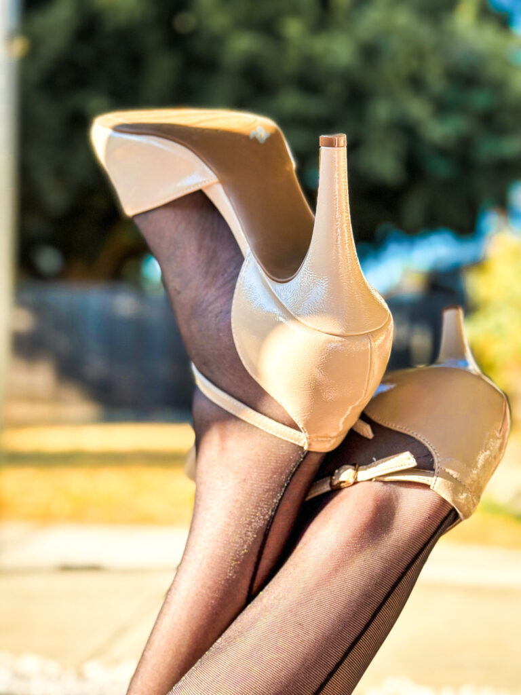

*Today, we welcome Adam* *from California to [Profiles of Beskirted Men](https://www.the-beskirted-man.com/category/profiles-of-beskirted-men/)!*

**What is your name?**

Adam

**Where are you from?**

California

**Which types of gender non-conforming clothing do you enjoy wearing?**

Skirts, Panties, Stockings and Garters, Pantyhose, Heels, Bras and Corsets and Leggings.

**When did you start wearing gender non-conforming clothing?**

29 years ago, at the start, it was a fetish and a way to manifest my fantasies, but now, later in life, I wear some form of feminine clothing daily, and it has become more of an expression of my unique personality.

**How did you start wearing gender non-conforming clothing and why?**

My first experience was when I was 14. I had a chance encounter with my best friend’s mom’s lingerie, and it has snowballed from there.

**What is your motivation now for putting on gender non-conforming clothing?**

I have been wearing for a while but recently my girlfriend encouraged me to paint my toe nails black and it has given me a new found drive to make my fashion style my own.

**What do gender non-conforming clothes mean to you?**

I struggled for many years with the concept of wearing feminine clothing and assuming it meant I was homosexual. It wasn’t until I met my girlfriend and I have with her support, came to embrace the fact that I can dress however I like, and it doesn’t have any correlation to my sexual orientation. Being a gender non-conformist allows me the freedom of personality that I suppressed for many years.

**How often do you wear gender non-conforming clothing?**

I wear panties every day. I have started to wear leggings and skirts on a more regular basis

**Do you go out in public dressed in gender non-conforming clothes? If not, why not?** **If so, how often and where do you go? Are there any places you wouldn’t go?**

My confidence is growing, and I am comfortable wearing leggings in public. This month was my first time wearing a skirts and pa those out shopping. It was an extremely nerve wracking yet rewarding experience.

**Do you find it hard to go out in public in gender non-conforming clothes?**

As I get older and wiser I find it is becoming easier to not care what others think. That has been the issue holding me back for many years.

**What is your best and/or worst experience in gender non-conforming clothes?**

I have yet to have a bad experience but am not fooling myself that it won’t happen. My best was when what at first looked to be a very stern African American security guard approached me while shopping and complimented me on my style and my tartan skirt. I was walking on air back to the car.

**Do your family or friends know about how you dress?**

My girlfriend knows, my friend and family don’t

**Does your partner accept your clothing choices?**

My partner is very supportive of my clothing choices. I wouldn’t be the person I am today with her support.

**What is your favorite style?**

I am going through a punk revival right now so pleated skater skirts and tartan are my go to. I am also a hiker so the kilt style works on both fronts.

**Where do you shop for your clothes?**

I have traditionally shopped both online and in person at department stores or outlets. While I like the anonymity of online purchases I love the social interactions when I’m purchasing at the store. I’ve always had great feedback on my choices from cashiers and on occasion some tips on sizing too.

<figure></figure>

<figure></figure>

*Thank you for sharing, Adam!*

*If you would like to have your profile featured in [Profiles of Beskirted Men](https://www.the-beskirted-man.com/category/profiles-of-beskirted-men/), take a look at the [post I wrote about it](https://www.the-beskirted-man.com/profiles-of-beskirted-men/profiles-of-beskirted-men/) for more details.*