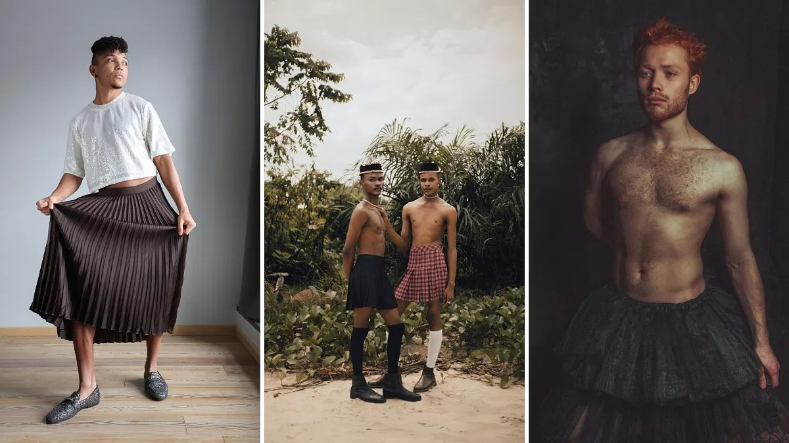

It’s amazing how often this question is asked on fashion blogs or in the news, but then nothing ever comes of it. This article is from 2022 and I think we know the answer to the question. Of course, that doesn’t mean we should give up though!

Are male skirts about to be the next fashion essential?

As Brad Pitt and a UK binman ditch their trousers to appreciate the breeze, we speak to a fashion expert on the skirt revolution.

[https://www.euronews.com/culture/2022/07/23/are-male-skirts-about-to-be-the-next-fashion-essential](https://www.euronews.com/culture/2022/07/23/are-male-skirts-about-to-be-the-next-fashion-essential)