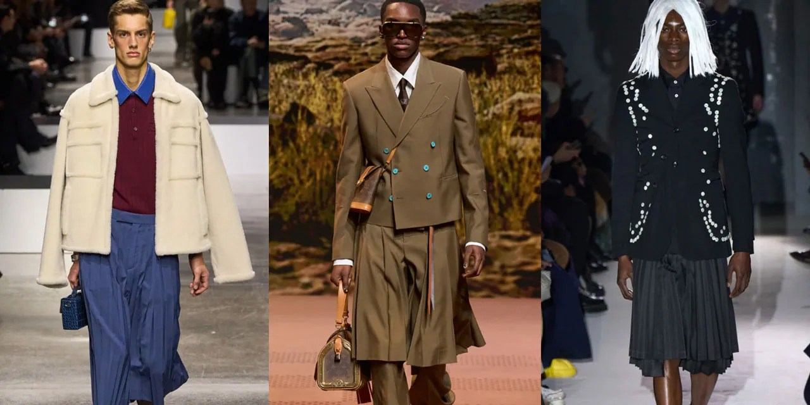

I think this is the first time I’ve ever posted anything that discusses men wearing skorts rather than skirts. The article is from 2024 and we know the answer to the question posed by the title, but one can still dream!

I’ve never actually tried skorts. To me, they defeat the purpose of wearing a non-bifurcated lower garment.

Are Skorts Going Mainstream in Menswear?

The traditionally feminine silhouette has appeared all over the Fall 2024 men’s runways, and it may become a staple sooner than you think.

[https://hypebeast.com/2024/1/skorts-menswear-trend-fall-2024-runway-paris-milan-fashion-week-analysis](https://hypebeast.com/2024/1/skorts-menswear-trend-fall-2024-runway-paris-milan-fashion-week-analysis)