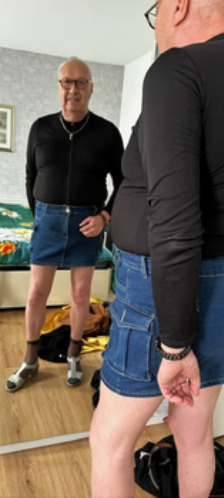

*Today, we welcome “Born too early” from Brabant, Netherlands to [Profiles of Beskirted Men](https://www.the-beskirted-man.com/category/profiles-of-beskirted-men/)!*

**What is your name?**

My nickname on Quora is: Born too early. I started with my own name, but my sons asked me to change it.

**Where are you from?**

I was born and raised in Amsterdam. Now I live in a village in Brabant.

**Which types of gender non-conforming clothing do you enjoy wearing?**

I like to wear all kinds of skirts and dresses, and I’m starting to try on blouses. Because of the huge variety of women’s clothing, I enjoy changing my outfit several times a day.

When it gets colder, I also wear tights and thin socks, as well as leggings. I have tried wearing bras, but I don’t find them comfortable.

I have a few pairs of high heels and thigh-high boots, as well as wigs, but I only wear them occasionally.

**When did you start wearing gender non-conforming clothing?**

It started somewhere in my early teens, when I put on my mother’s pantyhose. I also tried on an apron. It wasn’t until much later, when I was already married, that the feeling returned and became an urge…

**How did you start wearing gender non-conforming clothing and why?**

At first, I secretly started changing clothes every day/evening in my man cave, while I made sure my wife was watching television downstairs. A few years ago, it became an irresistible urge, because it felt so wonderful, liberating, and a little provocative! And the variety is fantastic…!

**What is your motivation now for putting on gender non-conforming clothing?**

I’ve been allowed to wear them at home for just over a year now. From that moment on, I didn’t want to wear anything else: I love the variety, the feeling, the freedom, and the challenge! But above all: I would never, ever want to be a woman or look like a woman. No way!!

**What do gender non-conforming clothes mean to you?**

For me, this clothing represents a new way of life: no restrictions. And above all, there is so much choice!

**How often do you wear gender non-conforming clothing?**

I wear them every moment of the day and night. At least, when I’m at home. Otherwise, they are partially hidden under my masculine clothing, such as pantyhose when it’s not too hot.

Whenever possible, I wear a plain dress (which looks like a polo shirt or sweater) with long pants or shorts over it.

At night, I always wear a long satin or silk nightgown, or satin pajamas.

Sometimes, when I’m alone, I try to dress up completely to make sure no one can mistake me for a woman. I just want to know how that feels.

**Do you go out in public dressed in gender non-conforming clothes? If not, why not?** **If so, how often and where do you go? Are there any places you wouldn’t go?**

No, I cannot appear in public wearing my favorite clothes.

I would prefer to do so in a modest manner. For example, wearing just a short denim pocketed skirt under a masculine, sturdy shirt.

However, it has become clear that this would have very unpleasant consequences for my sons and grandchildren. Even when I walk out onto the balcony of our apartment in a summer dress, his soccer-‘friends’ subtly suggest to my son: “Is your father okay?”

**Do your family or friends know about how you dress?**

My wife has given me permission to wear skirts at home, just to make me happy. She hates it because it goes against her idea of what men and women should wear. She doesn’t understand that she herself wears pants, which was impossible twenty years ago…

My sons and grandchildren have seen it occasionally. When I asked about it, my granddaughter (21 years old) said that you should do what you like, that it doesn’t hurt her, she said. But her father disagrees that she said so…

**Are there people you don’t want to know about it?**

My friends, members of the local shanty choir, won’t be able to accept it if I wear gender-neutral clothing.

It’s absolutely a no-go!

**Does your partner accept your clothing choices?**

My wife simply accepts it, but she does not like it.

**What is your favorite style?**

I try every style I can find, and I find that I can choose one depending on how I feel at that moment. It’s great to have so many options, and I love changing clothes several times a day.

**Where do you shop for your clothes?**

Almost all my clothes come from Temu: huge selection, including plus sizes. And so cheap that you can afford to throw something away if it doesn’t fit or looks terrible.

**Is there anything else you would like to add?**

Ik heb het grootste respect voor Alex Seifert, die een prachtige en zeer interessante blog heeft gemaakt met allerlei berichten over dit onderwerp.

*Alex’s translation: I have the greatest respect for Alex Seifert, who has made a wonderful and very interesting blog with all sorts of posts about this subject*.

**Do you have any links you would like to share (i.e. social media profiles or websites)?**

[https://menwearingadressorskirt.quora.com](https://menwearingadressorskirt.quora.com)

[https://mannendieeenjurkofeenrokdragen.quora.com](https://mannendieeenjurkofeenrokdragen.quora.com)

<figure><figcaption>Profiles of Beskirted Men: “Born too early”</figcaption></figure>

*Thank you for sharing, “Born too early”!*

*If you would like to have your profile featured in [Profiles of Beskirted Men](https://www.the-beskirted-man.com/category/profiles-of-beskirted-men/), take a look at the [post I wrote about it](https://www.the-beskirted-man.com/profiles-of-beskirted-men/profiles-of-beskirted-men/) for more details.*