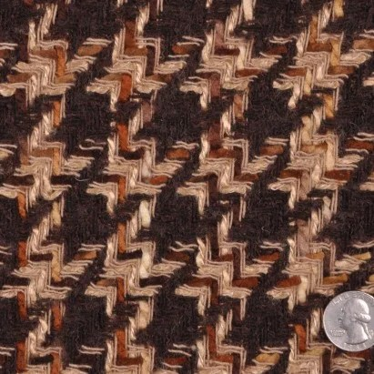

This article feels a little bit like search engine fodder, but even if that is true, it’s great that there is enough people searching for men in skirts that they feel the need to write about the topic.

Breaking Stereotypes: Why More Men Are Confidently Wearing Skirts

Breaking Stereotypes: Why More Men Are Wearing Skirts with Confidence For centuries, fashion has been an evolving expression of identity, culture, and individuality. While skirts have been traditionally associated with women’s fashion in many societies, history and modern trends show that this perspective is shifting. More men are embracing skirts as a confident and stylish…

[https://elizabethcustomskirts.com/breaking-stereotypes-why-more-men-are-confidently-wearing-skirts/](https://elizabethcustomskirts.com/breaking-stereotypes-why-more-men-are-confidently-wearing-skirts/)

There is also another post on this website that I thought might be worth mentioning:

Custom Skirts for Men – Find the Perfect Fit for Your Unique Style

Custom Skirts for Men: How to Find the Perfect Fit for Your Style Fashion is evolving, and skirts for men are becoming a bold and stylish choice for those who embrace individuality. Whether you’re looking for a casual, edgy, or formal look, a custom-made skirt can be the perfect way to showcase your personal style.…

[https://elizabethcustomskirts.com/custom-skirts-for-men-find-the-perfect-fit-for-your-unique-style/](https://elizabethcustomskirts.com/custom-skirts-for-men-find-the-perfect-fit-for-your-unique-style/)