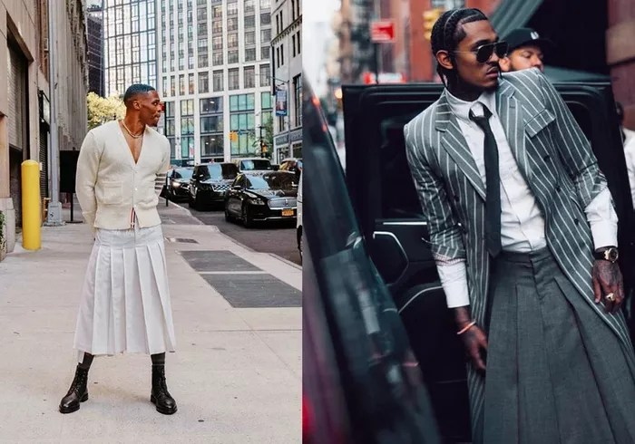

Of course a man can wear a dress! In any case though, this is quite an interesting post about men wearing dresses. It includes a bit of history as well as some styling tips and cultural discussion about it.

Can A Man Wear A Dress? A Deep Dive Into Gender Norms – Dailyfashionclothing.com

In the realm of fashion, the line between traditional masculine and feminine clothing has been continuously evolving. For decades, fashion was heavily

[https://www.dailyfashionclothing.com/archives/7184](https://www.dailyfashionclothing.com/archives/7184)