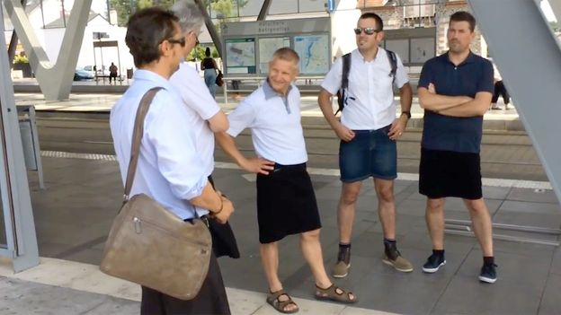

This old article from 2017 is a trope that we have seen multiple times in the past: men daring to wear a skirt to work in hot weather since they aren’t allowed to wear shorts. [We’ve also seen school children do it.](https://www.the-beskirted-man.com/in-the-media/schoolboys-wearing-skirts-to-protest-uniform-policies/)

It’s great they have the confidence to do so, but it would be nice if that became more of a widespread phenomenon and if more men would dare wear a skirt to work even in cooler weather.

Can’t wear shorts to work? Wear a skirt instead

A spell of scorching weather in Europe has prompted some men to swap their trousers for skirts – raising an age-old debate over dress code at work

[https://www.bbc.com/worklife/article/20170623-cant-wear-shorts-to-work-wear-a-skirt-instead](https://www.bbc.com/worklife/article/20170623-cant-wear-shorts-to-work-wear-a-skirt-instead)