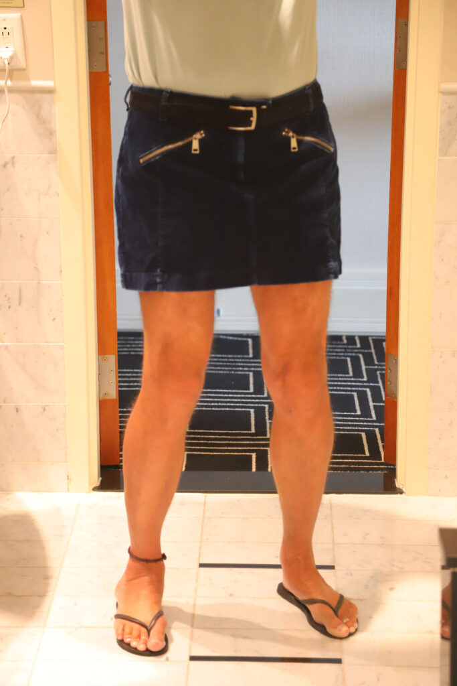
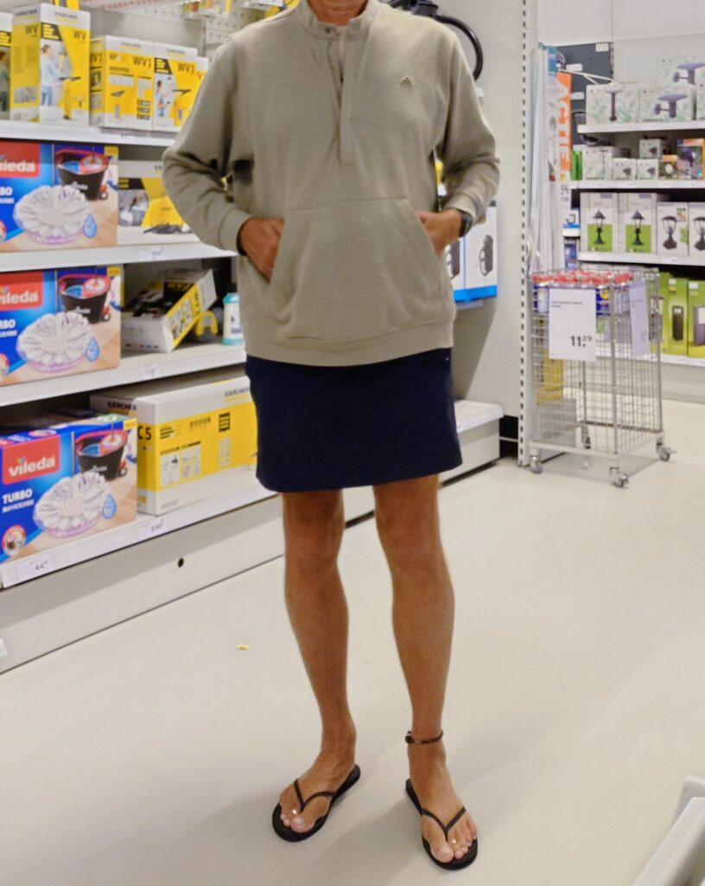
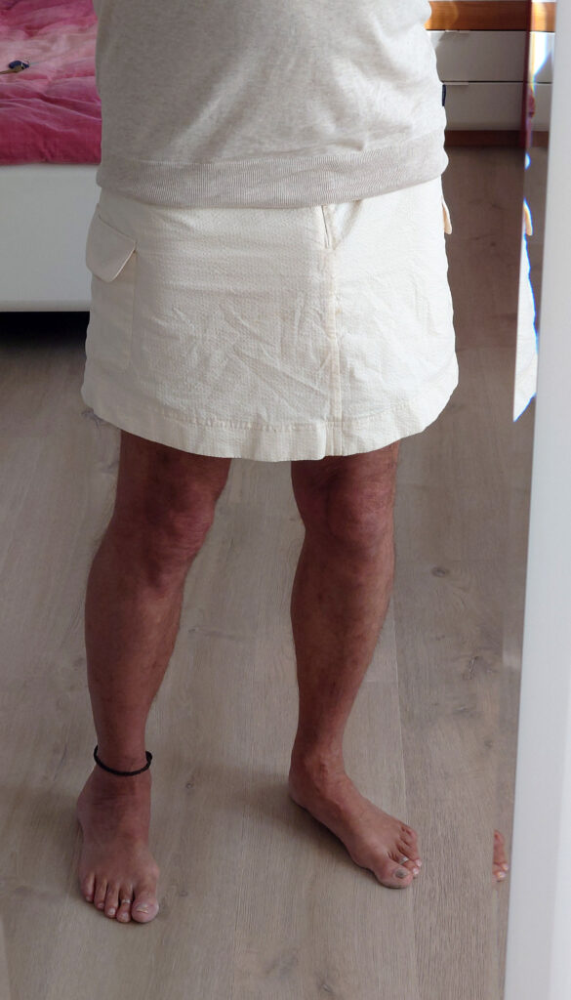
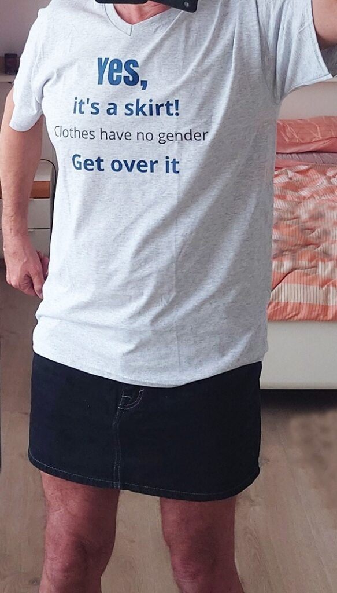
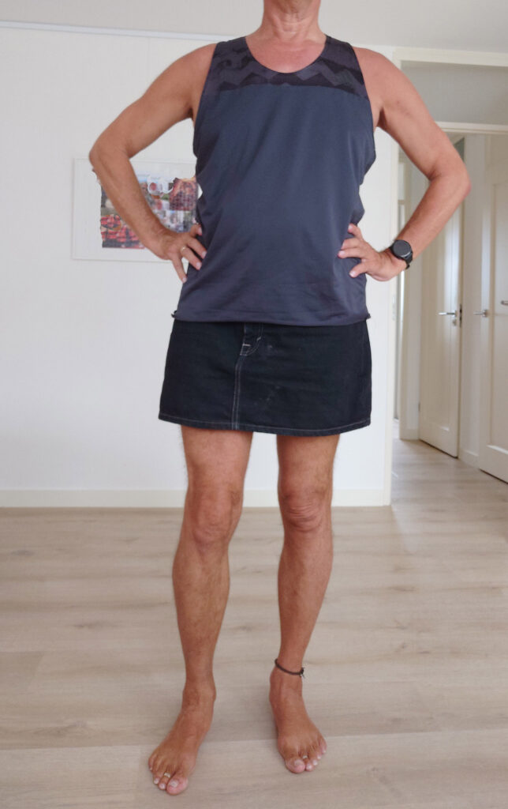
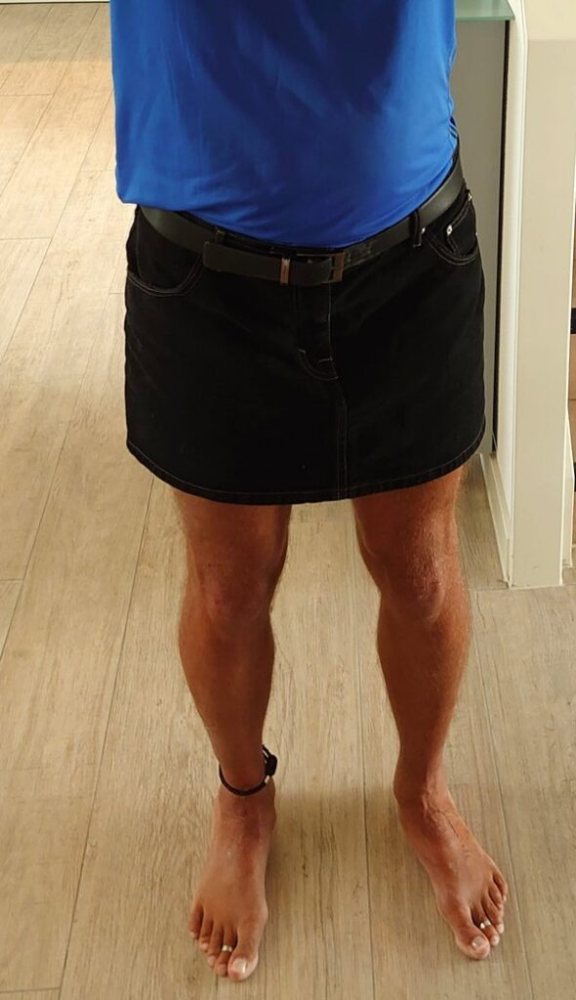
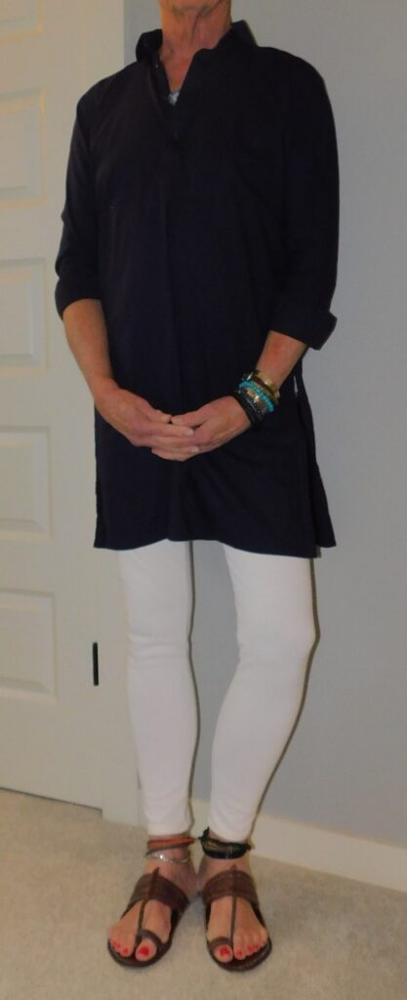

*Today, we welcome Cor van der Pas from the Netherlands to [Profiles of Beskirted Men](https://www.the-beskirted-man.com/category/profiles-of-beskirted-men/)!*

**What is your name?**

Cor van der Pas

**Where are you from?**

The Netherlands

**Which types of gender non-conforming clothing do you enjoy wearing?**

Skirts, mostly mini skirts, denim skirts and cargo skirts. Camisoles or spaghetti strap tanktops. Small flip-flops with narrow straps.

**When did you start wearing gender non-conforming clothing?**

About 5 years ago

**How did you start wearing gender non-conforming clothing and why?**

After discovering the great comfort offered by skirts, in addition to their style and practicality, I decided to wear short skirts instead of shorts.

**What is your motivation now for putting on gender non-conforming clothing?**

Skirts make me feel free and unrestricted, they offer real comfort to men and I like the style with the horizontal hem without useless short legs. In addition they are more practical than shorts and trousers, to put them on and for bathroom use, as I also prefer to go without underwear. Though it’s not the primary motivation, I also appreciate a gender neutral or somewhat feminine style, as it makes me feel a bit different and it has a sensual aspect.

I also like to show my bare feet, with an anklet, toe rings and painted toes.

**What do gender non-conforming clothes mean to you?**

Freedom and comfort in an attractive style, even a bit sensual.

In addition, it is about rejecting the absurd situation that women may choose their own clothes in any way while for men certain clothes are not allowed, for totally unclear reasons. Wearing “gender non-conforming clothes” essentially only can apply to men.

**How often do you wear gender non-conforming clothing?**

As I have abandoned shorts completely, I wear skirts at all occasions, everywhere and anytime that I used to wear shorts. That means in summertime, for shopping and any other informal activity. At home I wear skirts when it’s necessary to dress, as usually we don’t wear clothes at all there.

**Do you go out in public dressed in gender non-conforming clothes? If not, why not?** **If so, how often and where do you go? Are there any places you wouldn’t go?**

Yes, instead of shorts I wear skirts, for shopping, walking the streets, in summer every day, also including travelling. I may put on underwear for some occasions, like dentists but not always, a my pedicurist doesn’t mind. For the gym, I change my skirt into short tights.

Just like shorts, skirts are not suitable for truly formal occasions.

**Do you find it hard to go out in public in gender non-conforming clothes?**

It’s not really difficult, wearing skirts as a man you sometimes get strange looks, but there are few comments, most of which are even positive. With camisoles you get more attention, but that’s nothing compared to going barefoot, which is most noticed when I occasionally do so in public.

**What is your best and/or worst experience in gender non-conforming clothes?**

Over the years there have been lots of compliments, mostly by women. Very rarely there has been some disapproval, often in terms of being considered ‘gay’.

**Do your family or friends know about how you dress?**

Obviously they can see that.

**Are there people you don’t want to know about it?**

Skirts should be considered a private choice as an informal clothing style for men. If I wear skirts, people will know that, if they notice it. If I don’t wear skirts, people need not know about that.

**Does your partner accept your clothing choices?**

She loves it and has convinced me to try skirts. It should be added that we don’t wear clothes at all at home so this applies to outside clothing only.

**What is your favorite style?**

Short skirts with pockets, denim skirts, cargo skirts, sport skirts, in solid colors.

**Where do you shop for your clothes?**

Department stores, small stores and online.

**Is there anything else you would like to add?**

With skirts, I prefer to wear mini flipflops (often women’s) if I can’t go barefoot. I also like to decorate my bare feet by an anklet, silver toe rings and toe paint. So, I don’t like to wear heels in addition to skirts.

I like to have bare shoulders in summer, so I wear tank tops, occasionally with spaghetti straps.

**Do you have any links you would like to share (i.e. social media profiles or websites)?**

[https://menwearingadressorskirt.quora.com/](https://menwearingadressorskirt.quora.com/)  
[https://clotheshavenogender.quora.com/](https://clotheshavenogender.quora.com/)  
[https://everybodyskirts.com/](https://everybodyskirts.com/)

<figure></figure>

<figure></figure>

<figure></figure>

<figure></figure>

<figure></figure>

<figure></figure>

<figure></figure>

*Thank you for sharing, Cor van der Pas!*

*If you would like to have your profile featured in [Profiles of Beskirted Men](https://www.the-beskirted-man.com/category/profiles-of-beskirted-men/), take a look at the [post I wrote about it](https://www.the-beskirted-man.com/profiles-of-beskirted-men/profiles-of-beskirted-men/) for more details.*