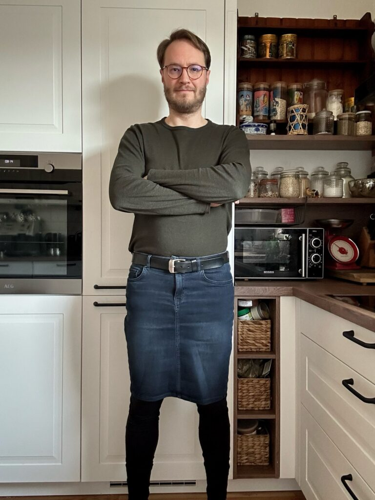
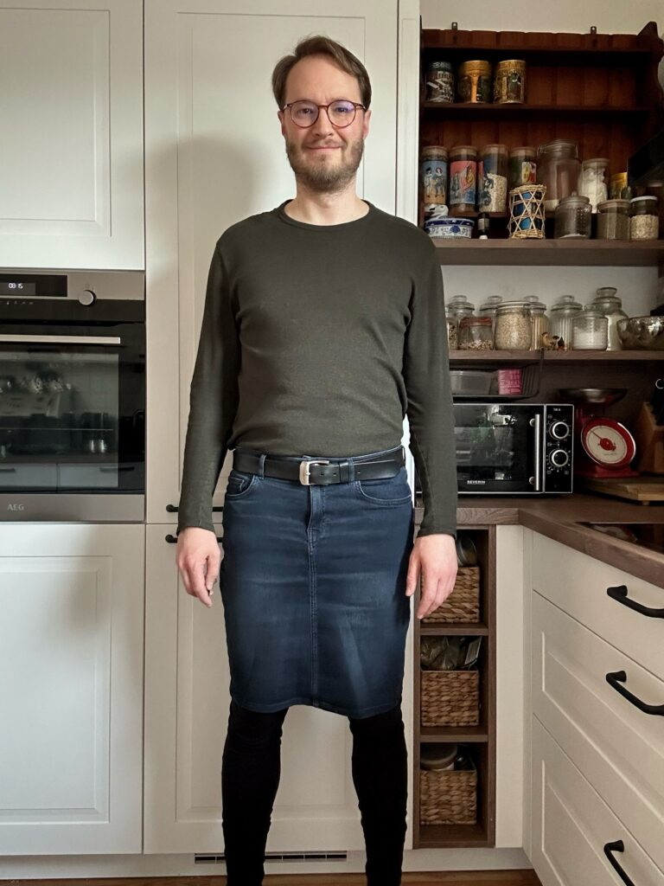
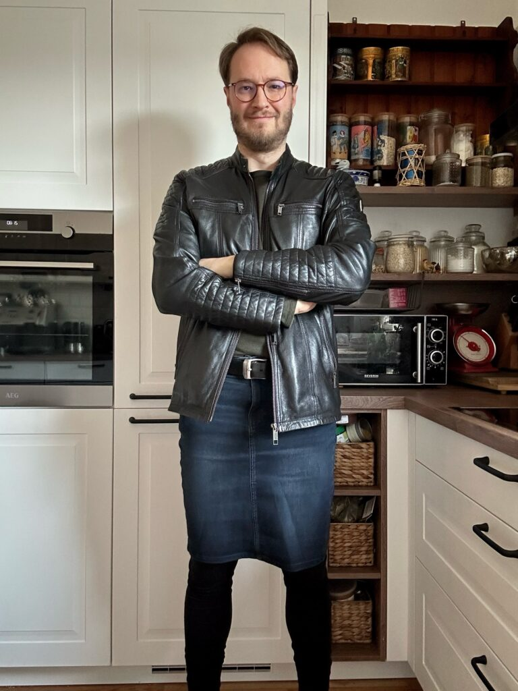
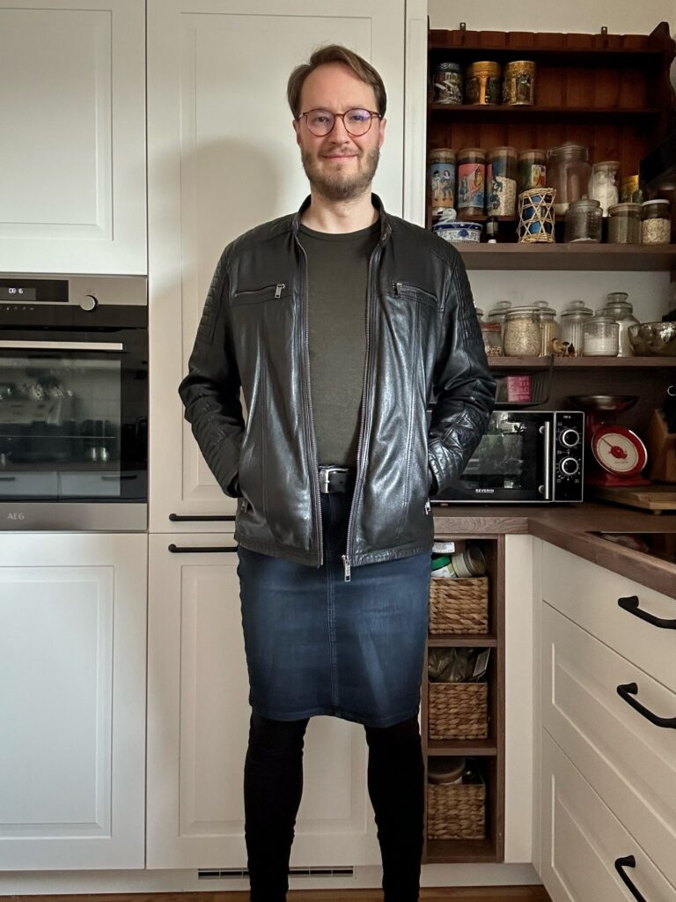
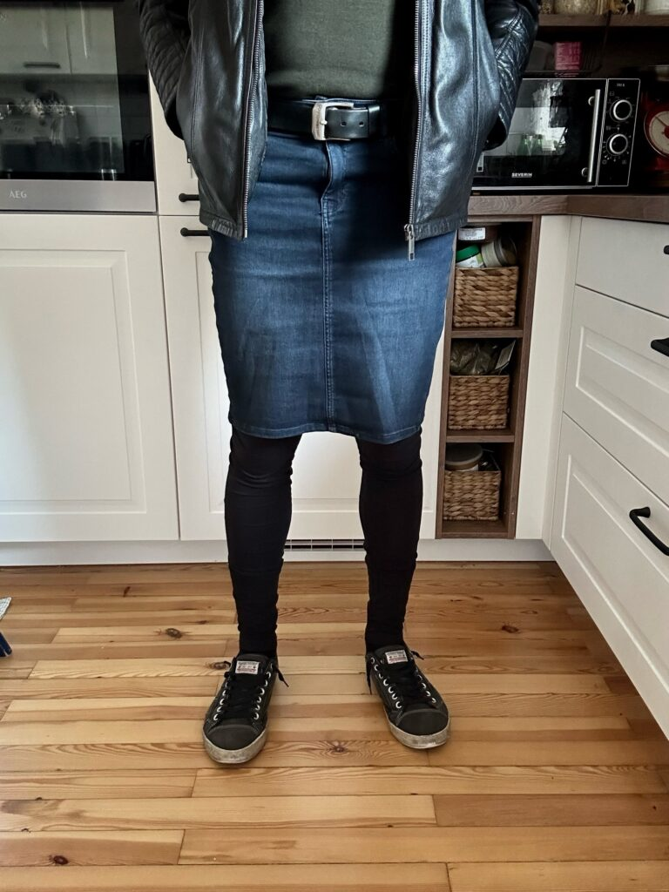
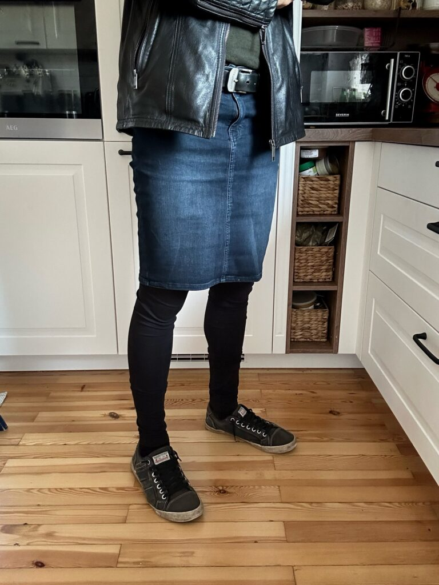
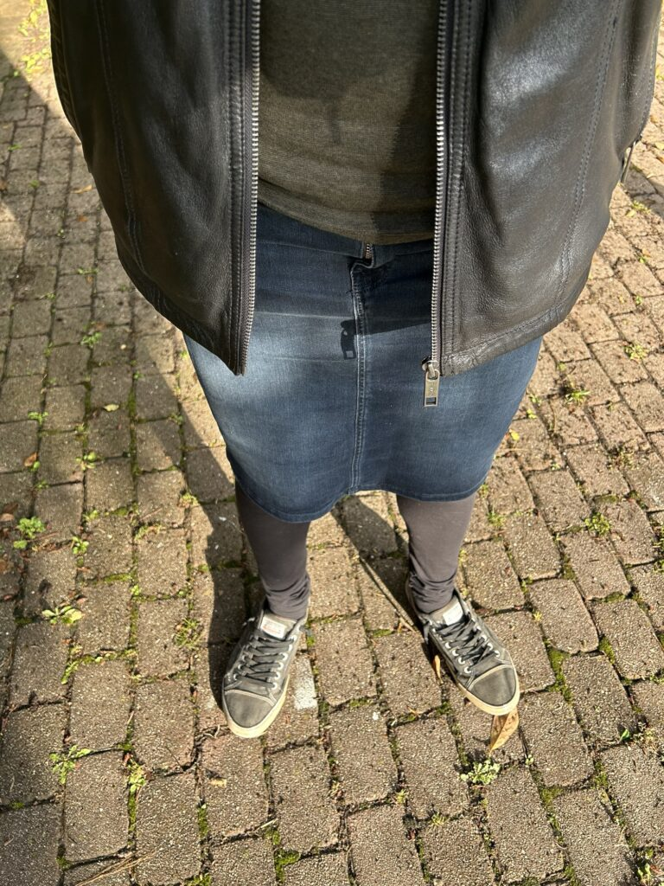

It’s finally time for another outfit. With the warm, spring weather we’ve had the past few days here in southern Germany, I thought now would be a great time to showcase one of my favorite spring/fall outfits. It’s casual, comfortable and I absolutely love wearing it.

This outfit features a dark blue denim pencil skirt with a collarless green shirt. I have a similar shirt in red that I also like wearing with this combination. The skirt is combined with black cotton leggings since it is still cool enough to require my legs to be covered but not so cool that I need thermal tights. Black, non-thermal tights would also work, but I find cotton leggings to be much more comfortable.

The pencil skirt is made out of stretchy denim which keeps it tight around the knees while allowing you to move freely. Some may not like the tightness, but I enjoy it.

For going outside, I wear my black leather biker jacket and my gray denim sneakers from Docker. Unfortunately, the sneakers are a bit worn out and Docker seems to have discontinued them. In the future, I might combine this with the black and white sneakers I have from Adidas. I go outside in this sort of outfit quite a bit.

A pair of black, brown or tan heeled boots would also look good with this combination, but would also make the outfit more formal. In this case, black tights might be a better look than the cotton leggings.

The outfit as shown consists of the following components:

-   Blue denim pencil skirt that I picked up cheap from eBay
-   Green (or red), lightweight, collarless longsleeve shirt
-   Black cotton leggings
-   Black leather biker jacket for going outside
-   Gray denim sneakers from Docker

<figure></figure>

<figure></figure>

<figure></figure>

<figure></figure>

<figure></figure>

<figure></figure>

<figure></figure>

*What do you think about the outfit? Would you change something about it or keep it the way it is? Let me know in the comments below!*