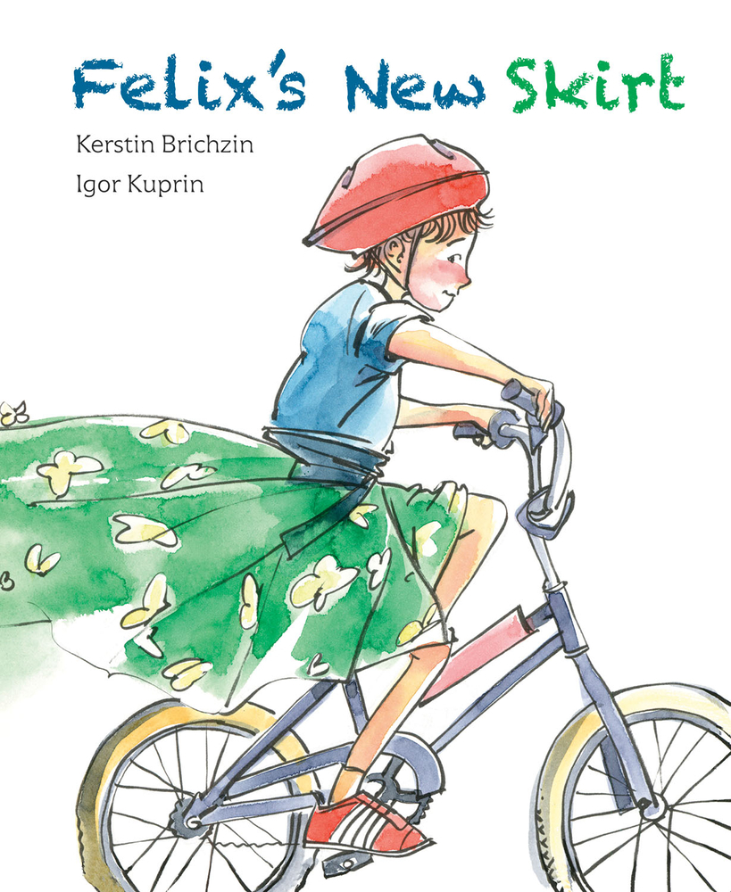

Today’s “In The Media” post is a bit unusual in that it is about a book I recently stumbled upon. This is a children’s book about a boy who likes to wear skirts. The book is called *Felix’s New Skirt*. It is written by Kerstin Brichzin and illustrated by Igor Kuprin. This is the summary as copied from GoodReads:

> Felix likes to wear skirts. He thinks they’re fun—plus he likes the way his legs move in them. His family doesn’t mind, but that’s not the case for Felix’s classmates. Their merciless teasing makes him want to give up school for good. Can Felix’s parents come up with a way to validate Felix’s expression, while also teaching the other children a lesson in acceptance? A timely picture book that tackles themes of empathy and tolerance in a world where it’s tough to be different.
> 
> [GoodReads](https://www.goodreads.com/book/show/39090898-felix-s-new-skirt)

I haven’t purchased the book, but will do so soon. If anyone has seen it or read it, let us know what you think about it! I may do a full review once I get it if there is some interest in that.

Felix’s New Skirt

Read 24 reviews from the world’s largest community for readers. Felix likes to wear skirts. He thinks they’re fun—plus he likes the way his legs move in th…

[https://www.goodreads.com/book/show/39090898-felix-s-new-skirt](https://www.goodreads.com/book/show/39090898-felix-s-new-skirt)