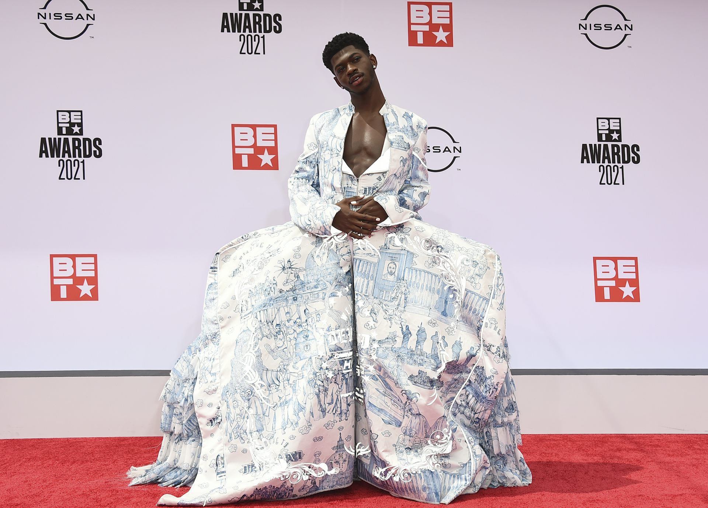

This week’s article is another one from [The Conversation](https://theconversation.com/) and discusses the history of men wearing dresses, where it all went wrong for them, and what it would take to make a dress that men might actually wear.

Friday essay: will the perfect men’s dress ever exist – and would men wear it?

More famous men are wearing dresses, harking back to ancient times, when androgynous clothing was the norm. But for male dresses to truly take off they might need a style separate to women’s.

[https://theconversation.com/friday-essay-will-the-perfect-mens-dress-ever-exist-and-would-men-wear-it-170112](https://theconversation.com/friday-essay-will-the-perfect-mens-dress-ever-exist-and-would-men-wear-it-170112)