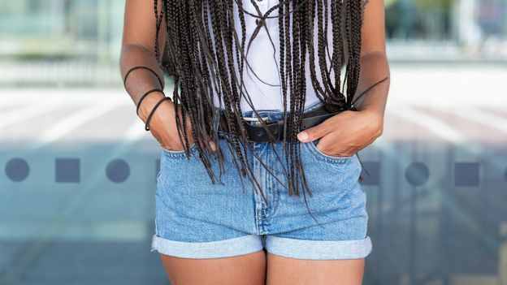

While this article isn’t strictly about men wearing gender-non-conforming clothing, it is most certainly a topic that is discussed quite a bit. One of the major things you have to get used to when first wearing skirts, pants or dresses from the women’s department, is the lack of pockets. It requires men, who are used to men’s clothing that has large, useful pockets, to come up with a different way to carry their things such as a bag like a backpack or purse, a jacket with pockets, or some other means.

I find it interesting that this is becoming a big enough topic to reach traditional mainstream media like the BBC. Hopefully, women’s clothing will also start to have useful pockets more frequently!

‘Girls need to carry things too!’: How women’s pockets became so controversial

Why do men’s clothes have so many pockets, and women’s so few? For centuries, the humble pocket has been a flashpoint in the gender divide of fashion. Is that finally set to change?

[https://www.bbc.com/culture/article/20250909-how-womens-pockets-became-so-controversial](https://www.bbc.com/culture/article/20250909-how-womens-pockets-became-so-controversial)