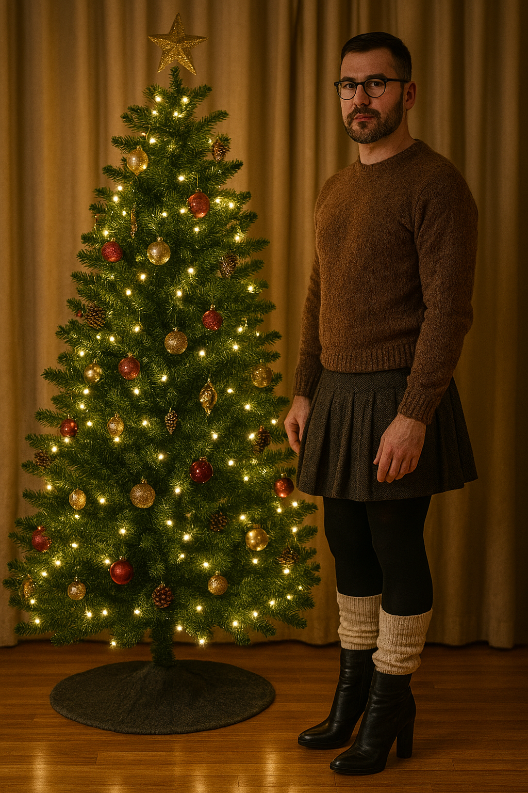

It’s already that time a year again! Most of us will be spending time with our families and friends which, unfortunately, can lead to conflict for some of us who don’t fully comply to gender norms. I’m fortunate enough to have a (mostly) accepting and supportive family who don’t mind me wearing skirts around them, as long as certain parts of the family aren’t present anyway.

It’s been an incredibly busy year for me having gone back to work full-time after taking time off to be with my son for a year. As such, I have not gotten around to updating this blog as much as I would have liked to, but hopefully I’ll have more time in the new year.

I hope all of you have a wonderful holiday season and a happy New Year!

This is the full version of the AI-generated title image:

<figure><figcaption>AI-generated image of a man in a skirt, tights and heeled boots standing next to a Christmas tree</figcaption></figure>