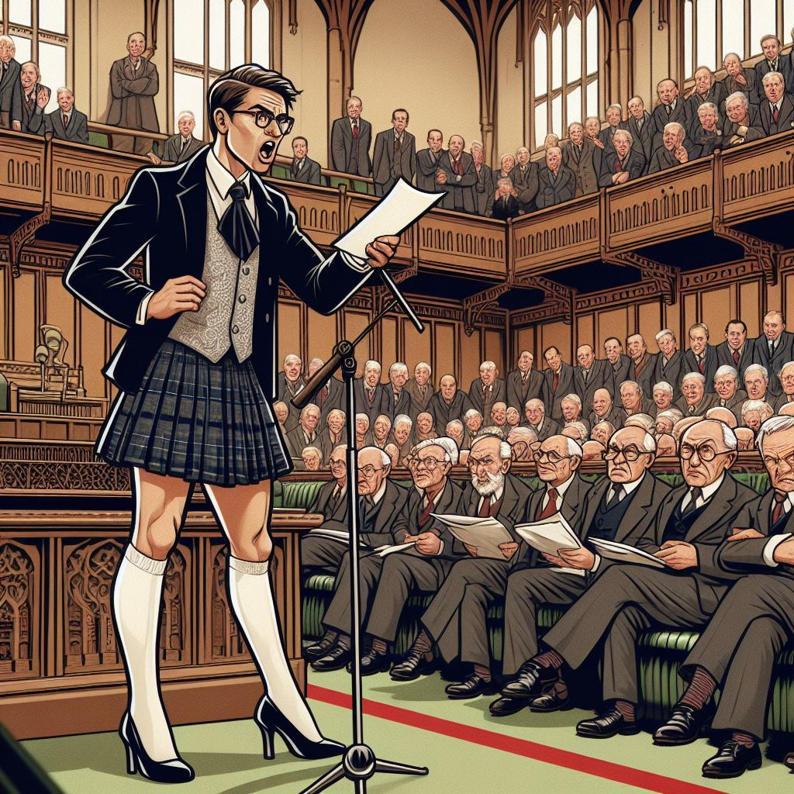

Despite wearing skirts and other gender-non-conforming clothing, most readers of The Beskirted Man that I have heard from identify as cis men. There is a plethora of reasons why they choose to wear gender-non-conforming clothes, but most do not identify as transgender.

So, you might be wondering why and how transgender politics might play a role in what we choose to wear. You may be surprised about all the ways we can be affected. Keep in mind that this is primarily going to be focused on the US, Canada and Europe where transgender rights are a very hot topic in the current politic discourse.

Transgender Rights Are Under Attack
-----------------------------------

Transgender rights have come under attack in many countries this year. Just recently, the Supreme Court of the United Kingdom ruled that [the legal definition of a woman is solely based on biological sex](https://www.bbc.com/news/live/cvgq9ejql39t). Across the pond, the Trump administration is moving to [ban transgender people from the military](https://www.npr.org/2025/05/06/nx-s1-5388507/supreme-court-transgender-military), is trying to [shut down a suicide hotline set up for transgender people](https://www.npr.org/sections/shots-health-news/2025/04/28/nx-s1-5375847/federal-government-may-cut-988-suicide-hotline-for-lgbtq-youth), is [banning trans athletes from participating in sports](https://apnews.com/article/donald-trump-transgender-athletes-3606411fc12efffec95a893351624e1b), and is generally demonizing and dehumanizing them as they ramp up the anti-trans rhetoric. Needless to say, the current state of their rights is abysmal.

Transgender people aren’t the only ones affected either. More generally, LGBTQIA+ rights are being attacked from right-wing politicians. There have been attempts to [ban drag shows](https://www.tampabay.com/news/florida-politics/2025/05/13/desantis-drag-show-law-appeals-court-hamburger-mary/), [gay clubs are being raided](https://www.advocate.com/news/pittsburgh-lgbtq-bar-raid#rebelltitem1), [same-sex marriage is under attack](https://theconversation.com/same-sex-marriage-is-under-attack-by-state-lawmakers-emboldened-by-trumps-anti-lgbtq-measures-and-the-supreme-courts-willingness-to-overturn-precedent-252154) and a number of other assaults on their rights have taken place in the last few months.

Fortunately, there are other countries that are trying to counter these issues. Canada and most of Western Europe have been actively advancing transgender and LGBTQIA+ rights rather than rolling them back despite threats from far-right parties such as the AfD in Germany, the National Rally in France and the Brothers of Italy in Italy. That is good news not only for trans people, but also for anyone who doesn’t conform to gender norms.

How This Affects Men Wearing Gender-Non-Conforming Clothes
----------------------------------------------------------

But what does this all have to do with men wearing gender-non-conforming clothes? After all, a lot of us aren’t transgender, even if some of us have [gone through the pain of gender dysphoria](https://www.the-beskirted-man.com/gender/wearing-skirts-and-heels-made-me-question-my-gender/). It all comes down to gender conformity and perception.

In the eyes of a lot of people, there is no difference between a man and a transgender woman wearing a skirt. Just recently, the US Secretary of Defence, Pete Hegseth, said in a speech about removing trans members from the military, [“No more dudes in dresses. We’re done with that shit.”](https://www.msn.com/en-in/news/world/no-more-dudes-in-dresses-pete-hegseth-after-us-supreme-courts-decision-on-transgender-military-ban/ar-AA1EjslJ) He clearly sees transgender women as being the same as “dudes in dresses” and therefore, logically, “dudes in dresses” would be the same as transgender women in his eyes.

So, where does that leave men who like to be seen as men, but also enjoy wearing dresses? It puts us in a bit of a conundrum. People who share his worldview are likely to see men in dresses or skirts as being transgender even if we are otherwise presenting entirely masculine and have no intention to be seen or identify as a woman.

There is also the association with homosexuality that some people have with men wearing skirts. One of the first questions I often hear when someone asks me about it is whether or not I am gay. What bothers me about this question is that, in their mind, a man wearing a skirt is too “feminine” to be heterosexual. It’s as though a man showing his feminine side must always be homosexual while a masculine man must always be heterosexual. It just simply doesn’t reflect reality. The risk here, no matter your actual sexual orientation, is that you fall victim to the anti-queer sentiment because you dare not visibily conform to gender norms.

What are the risks?
-------------------

As government-sanctioned discrimination against transgender people becomes more prominent in everyday life, it has the potential to put us at risk as well. There will be people who share Hegseth’s view and may act unpredictably towards a man in a skirt and heels, even if he is not trying to pass as a woman.

While a cis man wearing a skirt is not going to suffer the same legal consequences that transgender people have to face, he may have to deal with everyday discrimination. The automatic association with groups that are facing unprecedented discrimination in the modern era is going to trigger some people who support and participate in that discrimination. Depending on the area he is in, he could potentially face aggression in the form of verbal insults or, in the worst case scenario, physical violence.

Of course, those are extreme theoretical cases. Of all the times I’ve gone out in public in a skirt, I’ve only ever had [one negative experience](https://www.the-beskirted-man.com/personal-experiences/my-only-negative-experience-in-a-skirt-in-public/) and at no point did I feel threatened by it. That took place in the large city of Munich, Germany though which, while considered conservative by German standards, is still quite left-leaning compared to say, rural Texas or [Bournemouth, UK](https://www.mirror.co.uk/news/uk-news/left-and-right-wing-8850583).

Other, less serious risks are still forms of gender discrimination that we could face. One such example could be the rolling back of progressive changes to dress codes. Over the past several years, more and more places of work with dress codes have been loosening their restrictions allowing anyone of any gender to wear anything specified in their dress code. An example of that is Germany’s train operator, Deutsche Bahn. In 2022, they changed their rules so that [men can also wear uniform skirts](https://www.deutschebahn.com/en/group/People-Uniquely-different-/DB-Unternehmensbekleidung-feiert-Non-Binary-10465500) ([English translation](https://www-deutschebahn-com.translate.goog/en/group/People-Uniquely-different-/DB-Unternehmensbekleidung-feiert-Non-Binary-10465500?_x_tr_sl=de&_x_tr_tl=en&_x_tr_hl=de&_x_tr_pto=wapp)).

If those who sanction discrimination against transgender people had their way, they would make such “genderless” changes illegal. They want to build a sturdy wall between men and women just like they want to build other nonsensical walls. Another example is their odd [fear of gender-neutral restrooms](https://theconversation.com/whats-the-backlash-against-gender-neutral-bathrooms-all-about-57028). During the German general election in February, I saw a pamphlet for the German far-right party, AfD, that claimed they would “end all this gender insanity” if elected.

“A political liability”
-----------------------

I’ve mentioned in several of my posts and comments that I have a few transgender friends. One of them that I have known since first grade recently told me the story of how she lost her job because, in the current political climate in the US, she had become “a political liability.”

She had been with the company for just over 15 years and had worked her way up to a position on the board of directors. Customer acquisition was part of her responsibility and she was responsible for some of the company’s largest accounts.

However, the company also has several contracts from local, state and federal government agencies and about two months ago, they received a letter from the federal government saying they would cancel all contracts immediately if the company did not remove all DEI and transgender hires from leadership positions in the company. So, rather than lose the lucrative contracts, they bowed to the federal government’s demands and my friend as well as one of her African-American peers on the board were demoted.

It had nothing to do with “merit” and “performance” as the Trump administration claims to be champions of and defending with their actions. Instead, it had everything to do with who they were personally. The federal government isn’t just doing this to American companies either. They’ve even sent ultimatums to [foreign companies they’ve contracted in foreign cities](https://www.newsweek.com/european-city-reacts-trumps-dei-ultimatum-2068974).

You might ask what this story has to do with men wearing skirts. It is, in fact, very related. Last October, [I wore a skirt to the office for the first time](https://www.the-beskirted-man.com/in-public/my-first-time-wearing-a-skirt-to-the-office/). I’ve also worn heeled boots to the office many times, including on [my very first day at the company](https://www.the-beskirted-man.com/personal-experiences/heeled-boots-at-the-office/). My teammates have seen me in both as well as many members of management. A couple of the latter even praised me because they thought more diversity was great for the company culture.

That has, however, changed. Last October was the last time I was in the office. That was before Trump’s election and the topic of transgenderism and gender in general became a hot political topic. I am going to be traveling to the office again at the beginning of June for a series of required, in-person meetings. This time, however, I was specifically told that, while management admires my courage, I am not allowed to wear a skirt or heels due to the potential liability my actions could have. There wasn’t any further explanation and when I pressed for more details, I failed to receive a response.

But there it was again: that word, “liability.” The current political hostility towards anything gender-non-conforming is making what we do a “liability” which seems to be true even in Germany which is comparatively liberal and supportive. I don’t identify as transgender or anything other than a man who happens to like to wear skirts and heels, but that is enough to put fear into the hearts of anyone who might have even the remotest thing to lose because of my clothing preference and the willful ignorance of those who refuse to see it for what it actually is.

What We Can Do To Fight Back
----------------------------

Fortunately, we aren’t entirely helpless. There are things we can do to fight back and make sure that not only our right to wear what we want is respected, but also the basic human rights of others.

The first and easiest thing we can do is to raise awareness. This can occur in many different forms from writing about it on the internet, to taking part in protests or gatherings or even something as simple as talking to friends and family members about it. Essentially, spread the word about it in any form you can come up with!

Of course, simply getting out there and wearing your gender-non-conforming clothing in public is also an excellent way to raise awareness. By doing so, you help make it more visible and that is the only way it’s ever going to become more mainstream and thus more acceptable by those who don’t think it’s appropriate. The more men who do that, the stronger we become.

Supporting transgender rights and generally the rights of the LGBTQIA+ community is another key aspect. This can come in several different forms as well. For example, you can vote for political candidates that have a track record of supporting LGBTQIA+ rights. You can also donate to organizations that fight for their rights such as the [Human Rights Campaign](https://www.hrc.org) (US), [Stonewall](https://www.stonewall.org.uk) (UK), [Egale](https://egale.ca) (Canada), [The Trevor Project](https://www.thetrevorproject.org) (US) or [Transgender Europe](https://tgeu.org) (Europe and Central Asia).

By supporting transgender rights, you help to not only mitigate the risk to them but also to yourself.

Conclusion
----------

Wearing gender-non-conforming clothing as a cis man can be a rewarding experience and it is absolutely worth fighting for. The current political situation does, however, make it a bit riskier. Despite that, I suspect most men who wear these clothes out in public won’t notice much of a difference.

The places where we would be at the highest risk are the places we probably would have tended to avoid showing up to in a skirt in the first place. I certainly wouldn’t walk down the street of a small, rural town in the Ozarks of southern Missouri and northern Arkansas in a skirt and heels as a man. I wouldn’t have before transphobia became officially sanctioned and I most definitely wouldn’t now.

If you find yourself in a similar situation to me, you also have to consider whether it is worth losing your job over. At this moment in time, I’m not going to put my job at risk. I enjoy what I do, receive a good salary, have a mortgage to pay off and a family to feed. The job market is also very volatile at the moment, especially in the automotive industry where I am currently working, largely due to a certain person’s obsession with tariffs.

That doesn’t mean we should be entirely passive though. You can vote, you can donate and, if nothing else, get out there and be seen in your free time in that floral dress with whacky, colorful tights! Break the stereotypes, challenge people’s views, show them that a real man wears what he wants even if it isn’t what others expect him to wear! It may not be *their* definition of a “real man,” but the point is to challenge that archaic view of gender and be the person you want to be!

As a small aside, I liked the image that AI generated for this post so much that I decided to include it here at the bottom of the post again so that the entirety of the image is visible.

<figure><figcaption>AI-generated man in a skirt and heels giving a speech in a parliament full of angry old men</figcaption></figure>