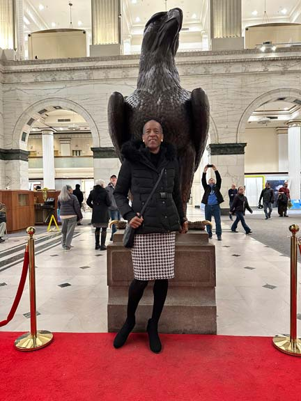
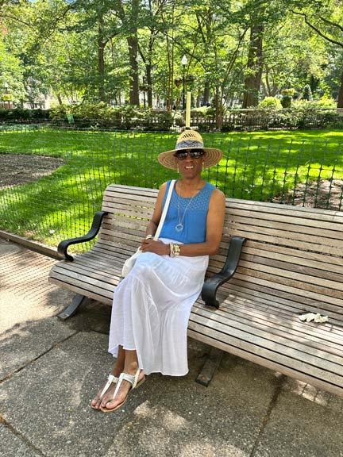

*Today, we welcome JeffB from Southeastern Pennsylvania to [Profiles of Beskirted Men](https://www.the-beskirted-man.com/category/profiles-of-beskirted-men/)!*

**What is your name?**

JeffB

**Where are you from?**

Southeastern Pennsylvania

**Which types of gender non-conforming clothing do you enjoy wearing?**

Skirts, dresses, tops, shoes, outerwear, underwear, sleepwear, tights (in winter), jewelry 

**When did you start wearing gender non-conforming clothing?**

I’d say around 1980 when I started wearing my mother’s dresses (in secret, she never knew) and liked it because I looked good in them, and that made me want to wear her clothes more and more. By 1991, I actively begun crossdressing and joined a local crossdressing group for a few years.

**How did you start wearing gender non-conforming clothing and why?**

Actually, it all began with shoes, not clothing. When I was thirteen, I was insanely curious about how women, mainly my mother could walk in high heels. However, being too afraid to ask her how she managed that feat, I sought my answer in the only way I could….by wearing her shoes myself. One day during summer vacation while she was at work and I had the house all to myself, I put on a pair of her pumps (fortunately, we wore the same size) and conducted my experiment. It took a few tries just to stand in the three inch heels, walking took a while longer as I stumbled and staggered around like a drunk leaving a bar at 2 a.m., but I eventually got the hang of it and discovered it was FUN! Every chance I could, I’d sneak into mom’s room to wear her heels because I loved it. Years later, curiosity got the better of me again as I wondered what it was like to wear mom’s dresses with her shoes, when I did, I liked what I saw, and the rest was history.

**What is your motivation now for putting on gender non-conforming clothing?**

Strictly enjoyment, it’s the best possible reason. I just LOVE wearing the clothes.

**What do gender non-conforming clothes mean to you?**

For me, it means being able to escape the narrow, constrictive norms required of men in regards to their dull, boring clothes. When I wear skirts, dresses and heels, I feel bold, free and empowered, it’s intoxicating, the joy I get from being in womenswear, what with the bright colors and soft, flowing fabrics is indescribable as it enables me to express myself in ways I never knew were possible. In fact, it wouldn’t be exaggerating to say that wearing women’s clothes helps me tap into my inner femininity, and that feels good.

**How often do you wear gender non-conforming clothing?**

I’d say three or four times a month for public outings. I’d like to do more, but work and life often gets in the way, however, most nights, I sleep in full slips and nightgowns.

**Do you go out in public dressed in gender non-conforming clothes? If not, why not?** **If so, how often and where do you go? Are there any places you wouldn’t go?**

Oh, yes, I do go out dressed in public as staying indoors is a waste of time. A usual outfit is a top with a skirt, or a dress with heels (or flats), earrings and a handbag. As for places I go: downtown in the city where I live, shopping malls, movie theaters and museums. I enjoy being among crowds of people on my outings.

**Do you find it hard to go out in public in gender non-conforming clothes?**

No, not at all, for me, it’s easy, I do it all the time. I mean, at the end of the day, it’s just clothes. Nothing more complicated than that.

**What is your best and/or worst experience in gender non-conforming clothes?**

My best experiences in non-conforming clothes are every time women compliment me on my attire, and those interactions I have with them are genuinely honest. One woman actually said I looked better in a dress than her, that meant a lot to me. Heck, there’s even been rare occasions when I’ve had men say nice things about me. As for a worst experience, other than having a car full of guys laugh at me in passing, that’s pretty much been it. 

**Do your family or friends know about how you dress?**

That’s a no on both.

**Are there people you don’t want to know about it?**

Family and friends.

**Does your partner accept your clothing choices?**

I live alone, so that’s not a concern.

**What is your favorite style?**

I like to look classy and stylish, even when it comes to casual wear because I always dress to impress. As a man who wears women’s clothes in public for all to see, it’s important to look proper and tasteful, not clownish or outrageous.

**Where do you shop for your clothes?**

Several places: Old Navy, JCPenney, H&M and the discount department at Macy’s. I buy all my clothes in person so I can gauge on the spot what looks good and what doesn’t, what works and what won’t. The only thing I buy online is footwear because it’s impossible to find size 13 women’s shoes in brick and mortar stores.

**Is there anything else you would like to add?**

Life is too short to deny yourself the pleasures you enjoy. If you want to wear non-conforming clothes, go for it!

<figure></figure>

<figure></figure>

<figure></figure>

*Thank you for sharing, JeffB!*

*If you would like to have your profile featured in [Profiles of Beskirted Men](https://www.the-beskirted-man.com/category/profiles-of-beskirted-men/), take a look at the [post I wrote about it](https://www.the-beskirted-man.com/profiles-of-beskirted-men/profiles-of-beskirted-men/) for more details.*