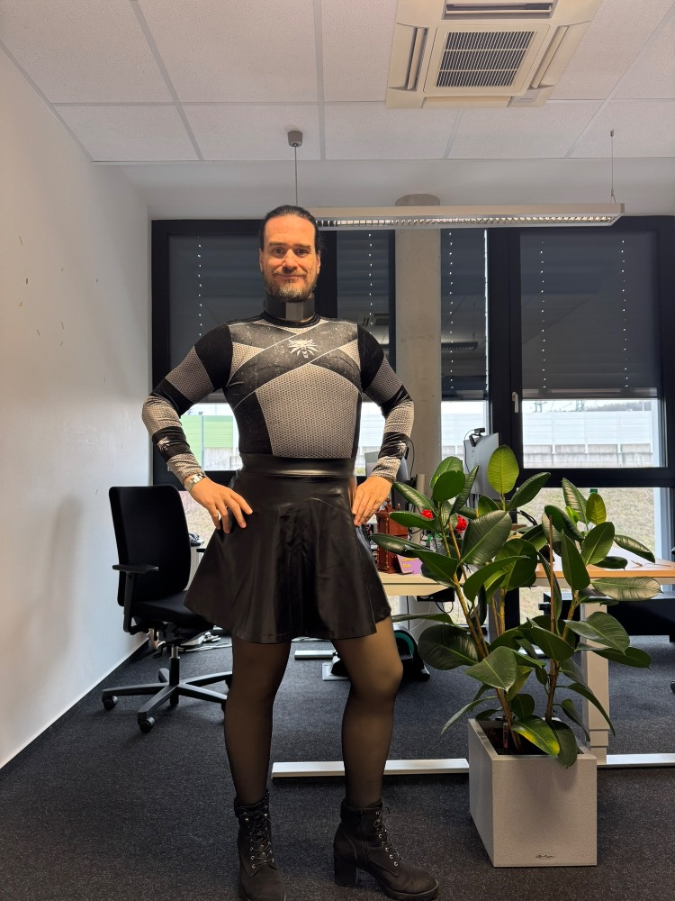
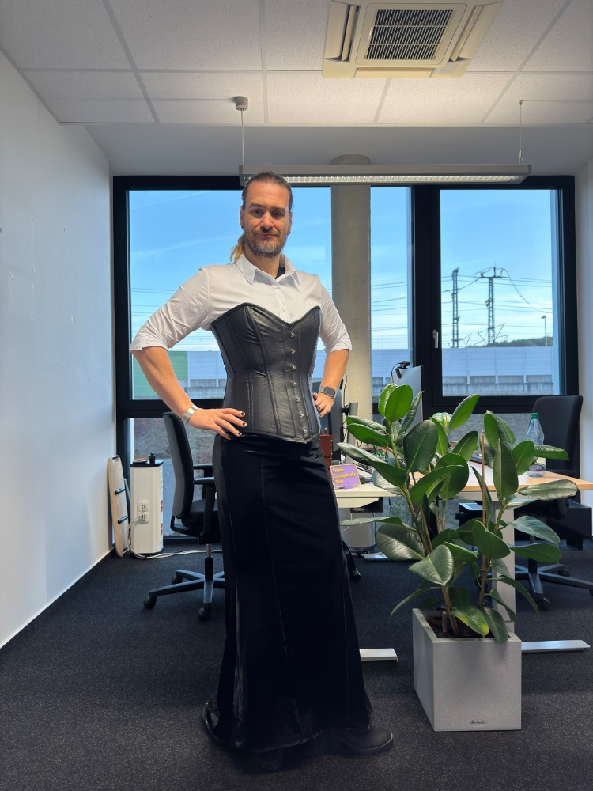

*Today, we welcome Jens from West of Hessen, Germany to [Profiles of Beskirted Men](https://www.the-beskirted-man.com/category/profiles-of-beskirted-men/)!*

*Note from the editor: The original answers were given in German and are included below. I translated the answers into English.*

**What is your name?**

Jens

**Where are you from?**

Germany, im Westen von Hessen

*Germany, west of Hessen*

**Which types of gender non-conforming clothing do you enjoy wearing?**

(Sport-)Badeanzüge, Röcke & Kleider (von Mini bis Maxi), Stiefel (gerne auch Overknees), Korsetts, gelegentlich Sport-BHs, Strumpfhosen (FSH im Sommer, Thermo im Winter), Leggings

*(Sports) swimsuits, skirts and dresses (from mini to maxi), boots (including over‑knee), corsets, occasionally sports bras, tights (sheer in summer, thermal in winter), leggings*

**When did you start wearing gender non-conforming clothing?**

Im Grund seit meiner Jugend. Die Anfänge dürften so um das Jahr 1990 +/- gewesen sein.

*Basically since my youth. The beginnings were probably around 1990, give or take.*

**How did you start wearing gender non-conforming clothing and why?**

In meiner Jugend war ich Leistungsschwimmer. Die Badeanzüge der Mädels haben mich schon damals beim Training fasziniert. Und auf einer Schwimmfreizeit mit dem Verein haben dann aus Jux ein paar der Älteren Jahrgänge sich bei einem Freundschaftswettkampf bei den Frauen für eine Staffel angemeldet. Und dafür hatte dann alle Jungs Badeanzüge angezogen. Das war bei mir im Kopf der Trigger, dass ich auch einmal einen Badeanzug anprobieren wollte. Der Zufall wollte es dann, dass ich noch im selben Jahr im Urlaub bei Verwandten zufällig den Sportbadeanzug meiner älteren Cousine in der Hand hatte. Und damit war es zum Thema Badeanzüge um mich geschehen und seitdem trage ich Badeanzüge.

Später im Laufe der Jahre sind dann auch Röcke, Kleider, Stiefel dazu gekommen.

Tja, warum? Gerade am Anfang war es eine Kombination aus zwei Dingen: Die Enge eines Badeanzuges gepaart mit den Hormonen eines pubertierenden Teenagers.

Später ist die erotische Komponente immer mehr in den Hintergrund getreten und ich habe mich einfach nur Pudelwohl in der Kleidung gefühlt.

*Back in my teens I was a competitive swimmer. Even then, during training, I was fascinated by the girls’ swimsuits. And at a club training camp, some of the older guys signed up for a women’s relay at a friendly meet just for fun. So all the boys put on swimsuits for it. That moment kind of planted the idea in my head that I wanted to try one on myself.*

*By coincidence, later that same year while visiting relatives, I happened to end up holding my older cousin’s sports swimsuit. And that was it — from that point on I was hooked, and I’ve been wearing swimsuits ever since.*

*Over the years, skirts, dresses, and boots have joined the mix as well.*

*Why? In the beginning it was really a combination of two things: the tightness of a swimsuit paired with the hormones of a teenage boy.*

*Later on, the erotic part faded more and more into the background, and I just felt completely comfortable in that kind of clothing.*

**What is your motivation now for putting on gender non-conforming clothing?**

Ich möchte mich wohlfühlen in meiner zweiten Haut!

*I want to feel good in my second skin!*

**What do gender non-conforming clothes mean to you?**

Ein Gefühl von Freiheit, ein Gefühl von Wärme, ein Gefühl von Geborgenheit. Ein Gefühl von „Ich-selbst-sein“!

*A feeling of freedom, a feeling of warmth, a feeling of security. A feeling of “being myself”!*

**How often do you wear gender non-conforming clothing?**

Quasi 24/7 – Im Alltag trage ich immer einen Badeanzug oder Sportbody als Unterwäsche.

Und dann sehr oft Röcke aus meinem Fundus. Von Mini bis Maxi mit Schleppe ist alles mit dabei (wobei ich nur wenige Midi-Röcke habe). Je nach Wetter (und Rock) kombiniere ich das ganze dann mit einer Glanzstrumpfhose, Thermostrumpfhose (oder alternativ auch einer Leggings). Dazu dann passende Stiefel. Seit letztem Jahr auch gerne mit einem Überbrustkorsett.

Oder alternativ eine Stretch Jeans nur mit Overknees.

Etwas seltener hole ich die Kleider aus dem Schrank.

Und ich bin immer noch regelmäßig im Schwimmbad und trage dort ausschließlich Sportbadeanzüge.

*Pretty much 24/7 — in everyday life I always wear a swimsuit or sports bodysuit as underwear.*

*And then very often one of my skirts from my collection. I’ve got everything from mini to maxi with a train (though I only have a few midi skirts). Depending on the weather (and the skirt), I pair it with shiny tights, thermal tights, or sometimes leggings. And then matching boots. Since last year I’ve also gotten into wearing an overbust corset with it.*

*Or alternatively, a pair of stretch jeans with over‑knee boots.*

*I take the dresses out of the closet a bit less often.*

*And I still go to the pool regularly, and there I only wear sports swimsuits.*

**Do you go out in public dressed in gender non-conforming clothes? If not, why not?** **If so, how often and where do you go? Are there any places you wouldn’t go?**

Wie in der vorherigen Frage schon geschrieben, trage ich im Schwimmbad (oder auch am Strand) ausschließlich Sportbadeanzüge.

Aber auch meine Röcke, mein Korsett und meine Stiefel trage ich in der Öffentlichkeit und gehe damit auch ins Büro.

Zumindest in den Gegenden, in denen ich bislang war – meine alte Heimat Hannover, die Heimat meiner Frau Kassel, unser Wohnort, wo wir bislang im Urlaub waren (Niederlande, Belgien, Österreich (Tirol) – habe ich bislang keine Sorge gehabt, z.B. in einem Rock in der Öffentlichkeit unterwegs zu sein. Wobei es aber insbesondere in den größeren Städten sicherlich auch Gegenden gibt, wo man besser nicht im Rock als Mann unterwegs ist (auf der anderen Seite will man in solchen Gegenden eigentlich gar nicht unterwegs sein).

*Like I wrote in the previous answer, at the pool (or at the beach) I only wear sports swimsuits.*

*But I also wear my skirts, my corset, and my boots out in public — I even go to the office like that.*

*At least in the places I’ve lived or spent time — my old hometown Hanover, my wife’s hometown Kassel, where we live now, and the places we’ve been on vacation (the Netherlands, Belgium, Austria/Tyrol) — I’ve never had any worries about going out in public wearing a skirt, for example.*

*Of course, especially in bigger cities, there are probably areas where it’s better not to walk around as a man in a skirt. Then again, those are usually the kinds of areas you wouldn’t want to be in anyway.*

**Do you find it hard to go out in public in gender non-conforming clothes?**

Anfangs ja. Als ich im Jahr 2000 das erste Mal im Badeanzug im Schwimmbad war, hatte ich ganz schön Muffensausen. Zum Glück war ich nicht alleine, sondern hatte eine Person an meiner Seite (KtV aus dem Forum für Männer im Badeanzug), die mir hier viel meiner Ängste genommen hat.

In den Jahren danach habe ich mir selbst aber bei allen anderen Kleidungsstücken immer selbst im Kopf Schranken gesetzt und mich blockiert.

Erst die Covid-19 Pandemie und damit verbunden ein zu früher Todesfall in der entfernteren Familie hat mir die Augen auf die Endlichkeit bewusst geöffnet und mir quasi eine unsichtbare „Lotushautblase“ verpasst. Seit dem habe ich keine Sorgen/Ängste mehr, wenn ich mich so kleide, wie es mir gerade gefällt.

Aber es hat viele Jahre hierfür gebraucht!

*At the beginning, yes. When I went to the pool in a swimsuit for the first time in 2000, I was really nervous. Luckily I wasn’t alone. I had someone with me (KtV from the “men in swimsuits” forum) who helped take a lot of that fear away.*

*In the years after that, though, I kept putting mental barriers in my own way whenever it came to other types of clothing. I kept blocking myself.*

*It wasn’t until the Covid‑19 pandemic, and a premature death in the extended family, that I really became aware of how finite life is. It kind of gave me this invisible “lotus-skin bubble.” Since then, I haven’t had any worries or fears about dressing the way I feel like dressing.*

*But it took many years to get there.*

**What is your best and/or worst experience in gender non-conforming clothes?**

Wenn ich auf der Arbeit inbs. von Kolleginnen für meine Outfits gelobt werde. Sowas geht innerlich runter wir Öl. Und letztens hat mich eine Kollegin angesprochen, dass sie sich wegen meiner Outfits mit meinem Korsett selbst eins gekauft hat!

Auf der anderen Seite hatten wir Ende 2025 in einem Erlebnisbad eine eher negative Erfahrung. Wir (meine Frau, unsere Kinder und ein Freund von uns) waren dort und wir wurden nach kurzer Zeit vom Personal angesprochen, dass unsere Badeanzüge nicht Familientauglich seien. Nach kurzem Gespräch, in dem ich zumindest mit meinem schlichten, schwarzen Sportbadeanzug alle Argumente der Person widerlegen konnte (mein Badeanzug hat tatsächlich an allen relevanten Stellen mehr verdeckt als manche Sportbadehose von einigen der Männer im Bad), ließ die Person sich aber nicht überzeugen, auch den Sportbadeanzug unseres Freundes anzuerkennen – und dass nur, weil dieser zu „bunt“ war.

*When I get compliments at work, especially from female colleagues, about my outfits. That kind of thing just feels amazing on the inside. And recently one colleague even told me that because of my outfits with the corset, she went and bought one for herself!*

*On the other hand, we had a pretty negative experience at a water park at the end of 2025. We (my wife, our kids, and a friend of ours) were there, and after a short time the staff approached us and said our swimsuits weren’t family‑friendly. After a brief conversation where I could easily counter all of their arguments with my plain black sports swimsuit (which honestly covered more in all the relevant places than some of the men’s swim briefs in the pool), the staff member still refused to accept our friend’s sports swimsuit. And only because it was “too colorful.”*

**Do your family or friends know about how you dress?**

Ja! Ich habe meiner Frau damals recht früh, nachdem wir uns kennengelernt haben, von meiner Leidenschaft für Badeanzüge erzählt. Und dann auch nach und nach für die anderen Kleidungsstücke.

Meine Kinder wachsen direkt mit meinen Outfits auf und auch sonst verstecke ich mich nicht. Allerdings gehe ich auch nicht damit hausieren.

*Yes! I told my wife about my love for swimsuits pretty early on after we met. And then, bit by bit, about the other clothing items too.*

*My kids are growing up with my outfits from the start, and I don’t hide it from anyone. But I also don’t go around making a big deal out of it.*

**Are there people you don’t want to know about it?**

Früher? Ja! Heute? Nein!

*Earlier? Yes! Today? No!*

**Does your partner accept your clothing choices?**

Ja! Zum Glück. Es gibt zwar auch ein paar Kombinationen bei mir im Schrank, die ich nicht trage, wenn wir gemeinsam unterwegs sind, aber die meisten meiner Stücke gefallen ihr an mir.

*Yes! Luckily. There are a few combinations in my closet that I don’t wear when we’re out together, but most of my pieces are things she actually likes on me.*

**What is your favorite style?**

Ich trage im Moment, vor allem wo es noch etwas kälter ist, gerne meine Mini-Röcke in Kombination mit einer Thermostrumpfhose und Stiefeln.

Und jetzt, wo es wieder etwas wärmer wird, kommt mein langer Mermaid-Rock mit Schleppe wieder hervor. Das kombiniere ich dann mit einer Bluse und meinem Korsett.

Siehe die beiden Fotos, die ich hier mit beigefügt habe.

*Right now, especially while it’s still a bit colder, I really like wearing my mini skirts combined with thermal tights and boots.*

*And now that it’s getting a bit warmer again, my long mermaid skirt with a train is coming back out. I pair that with a blouse and my corset.*

*You can see both outfits in the two photos I attached here.*

**Where do you shop for your clothes?**

Oft online, aber auch, wenn ich Dinge vorher probieren will, im Geschäft oder auf Veranstaltungen.

*Often online, but also in stores or at events when I want to try things on beforehand.*

**Is there anything else you would like to add?**

Ich möchte gerne zwei Dinge allen da draußen mitgeben.

1\. Meister hat Dobby eine Socke gegeben, Dobby ist ein freier Elf

Dieser Spruch sagt schon viel: Es ist „nur“ Kleidung, aber auch Kleidung, die befreit!

2\. Eine Passage von Queen aus dem Song Innuendo:

*Through the sorrow all through our splendour*  
*Don’t take offence at my innuendo*

*You can be anything you want to be*  
*Just turn yourself into anything you think that you could ever be*  
*Be free with your tempo be free be free*  
*Surrender your ego be free be free to yourself*

Auch hier ist das Ergebnis im Grunde gleich: Befreie Dich und lass Deiner Seele und Deinen Wünschen freien Lauf!

*I’d like to share two things with everyone out there.*

*1\. Master has given Dobby a sock, Dobby is a free elf.*

*That line already says a lot: it’s “just” clothing, but it’s also clothing that can set you free.*

*2\. A passage from Queen’s Innuendo:*

Through the sorrow all through our splendour  
Don’t take offence at my innuendo

You can be anything you want to be  
Just turn yourself into anything you think that you could ever be  
Be free with your tempo be free be free  
Surrender your ego be free be free to yourself

*And here the result is basically the same: free yourself and let your soul and your wishes run free!*

**Do you have any links you would like to share (i.e. social media profiles or websites)?**

Instagram: @Sternmiere

Website: [https://quarkdose.de](https://quarkdose.de)

<figure></figure>

<figure></figure>

*Thank you for sharing, Jens!*

*If you would like to have your profile featured in [Profiles of Beskirted Men](https://www.the-beskirted-man.com/category/profiles-of-beskirted-men/), take a look at the [post I wrote about it](https://www.the-beskirted-man.com/profiles-of-beskirted-men/profiles-of-beskirted-men/) for more details.*