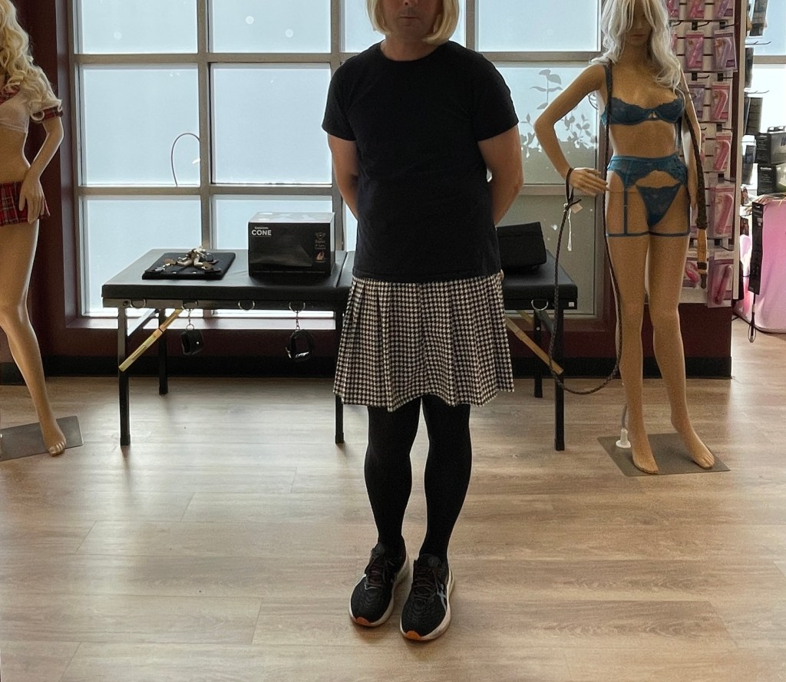

*Today, we welcome KJ from Ireland to [Profiles of Beskirted Men](https://www.the-beskirted-man.com/category/profiles-of-beskirted-men/)!*

**What is your name?**

KJ

**Where are you from?**

Ireland

**Which types of gender non-conforming clothing do you enjoy wearing?**

Everything really, lingerie, skirts, dresses, tights & stockings, leggings, tops.

**When did you start wearing gender non-conforming clothing?**

When i was 4 or 5 my sisters used to let me wear their clothes then i realised it wasn’t the done thing unfortunately.

**How did you start wearing gender non-conforming clothing and why?**

In my teens i started again when i was using my sisters room for studying. She was in college and her clothes were in the room so i tried on her stuff frequently.

**What is your motivation now for putting on gender non-conforming clothing?**

I just love the feeling of wearing skirts and dresses and leggings.

**What do gender non-conforming clothes mean to you?**

I just love how they make me feel

**How often do you wear gender non-conforming clothing?**

When i work from home a couple of days a week i will wear leggings or a skirt.

**Do you go out in public dressed in gender non-conforming clothes? If not, why not?** **If so, how often and where do you go? Are there any places you wouldn’t go?**

I have done but not often and it has been when i am in a different country.

**Do you find it hard to go out in public in gender non-conforming clothes?**

I’ve only done it a few times and in afraid to be seen by someone i know but I’m getting braver

**What is your best and/or worst experience in gender non-conforming clothes?**

Best experience was shopping in a US outlet mall and just loving the feeling of being out dressed.  
Worst was probably a few dirty looks i got that same day.

**Do your family or friends know about how you dress?**

Wife knows and doesn’t like it. She wishes i wouldn’t do it but accepts the fact that i do. Also a female work colleague but she doesn’t like it either.

**Are there people you don’t want to know about it?**

It’s kind of a strange answer, in my dreams i want everyone to see me in a skirt or dress but the reality is that i wouldn’t be able to deal with the consequences.

**Does your partner accept your clothing choices?**

Just about

**What is your favorite style?**

Little black dress or pleated mini skirt with opaque tights and boots

**Where do you shop for your clothes?**

Online or in store when traveling

**Is there anything else you would like to add?**

Love your work, you really are a pioneer

<figure><figcaption>Profiles of Beskirted Man: KJ</figcaption></figure>

*Thank you for sharing, KJ!*

*If you would like to have your profile featured in [Profiles of Beskirted Men](https://www.the-beskirted-man.com/category/profiles-of-beskirted-men/), take a look at the [post I wrote about it](https://www.the-beskirted-man.com/profiles-of-beskirted-men/profiles-of-beskirted-men/) for more details.*