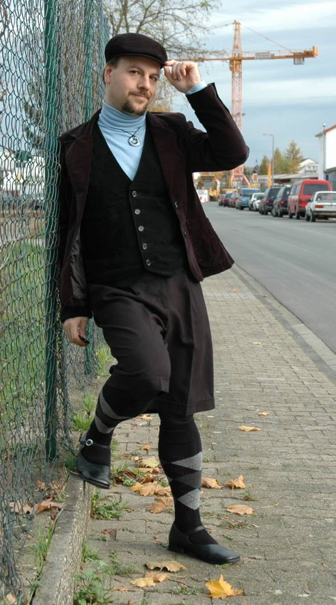
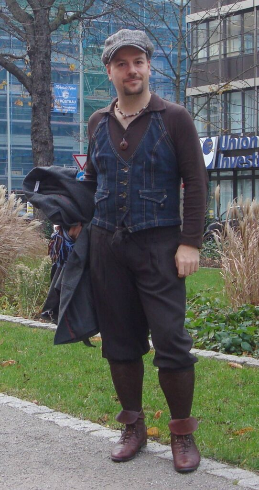
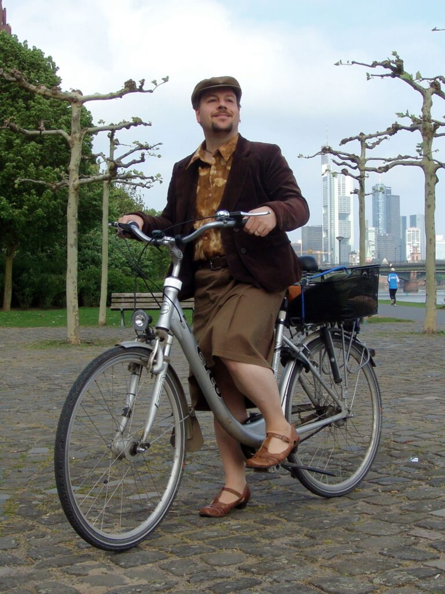
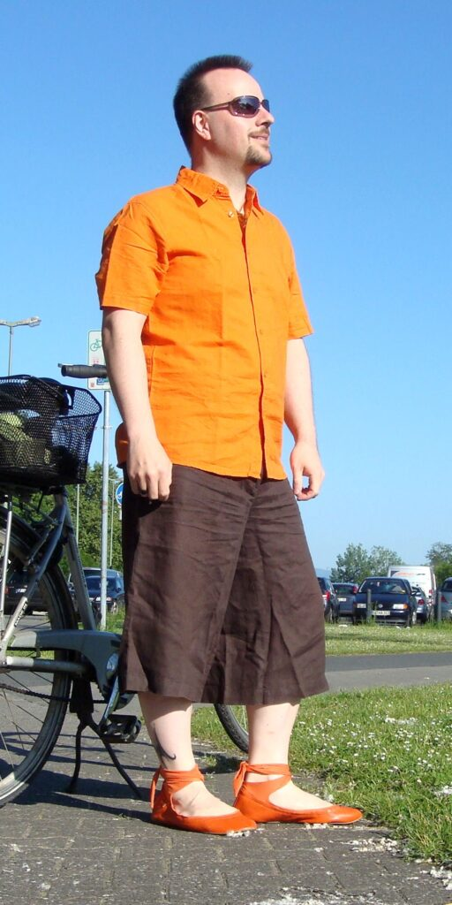
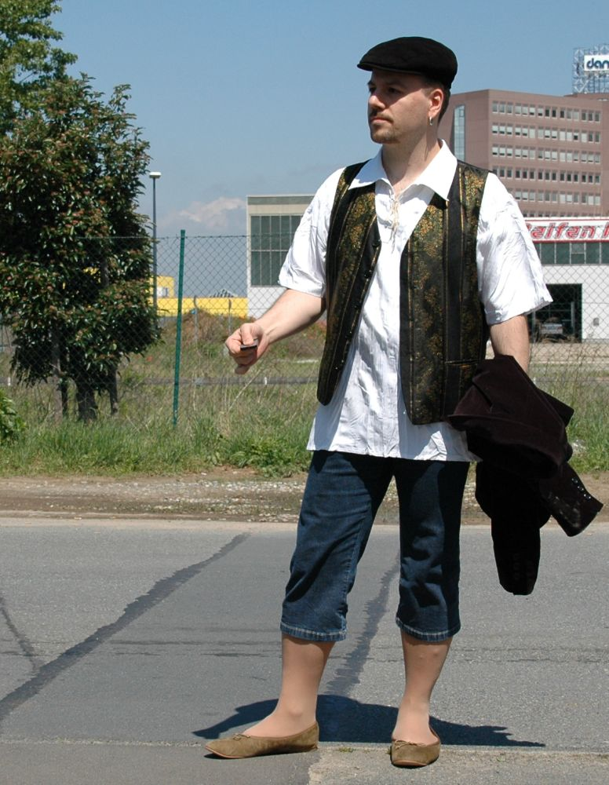
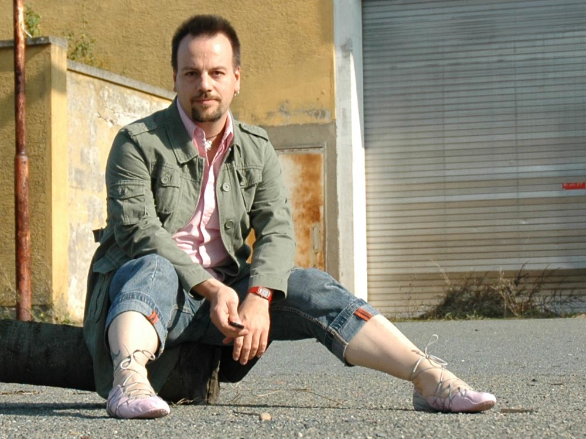
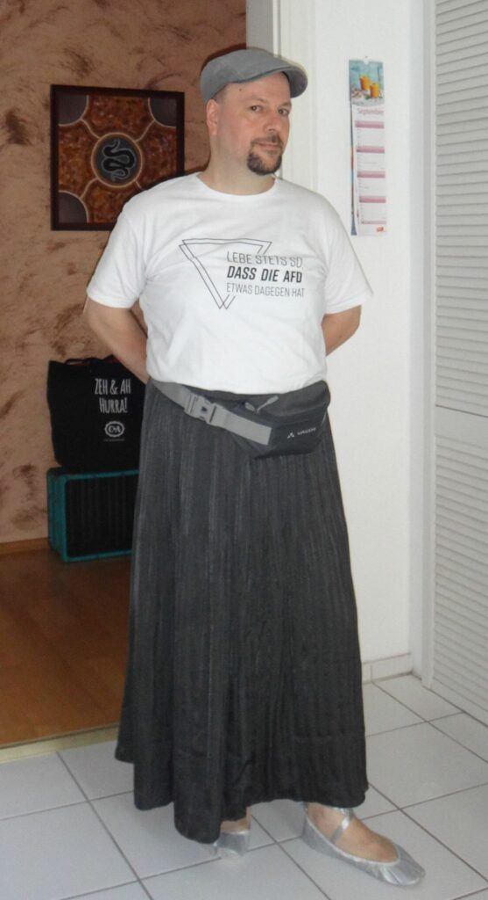
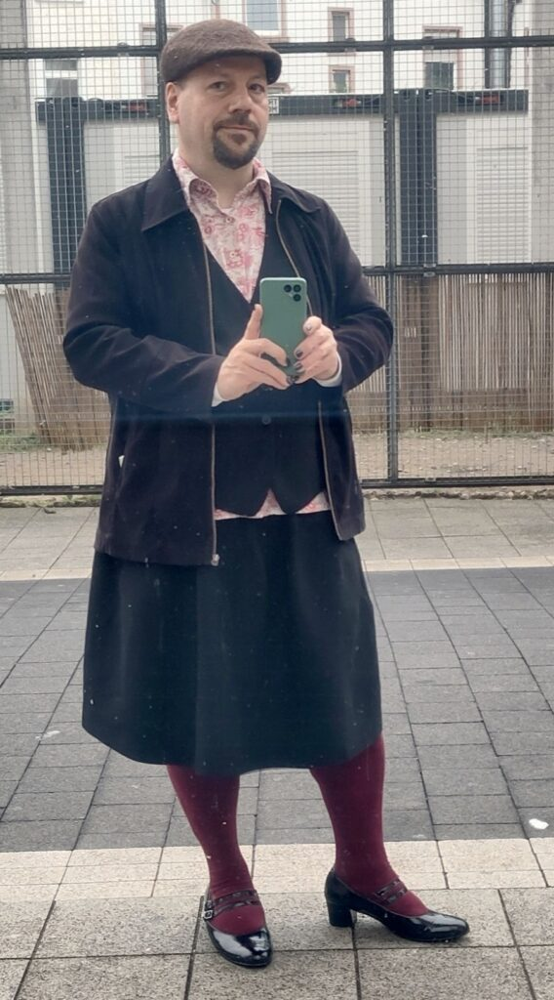
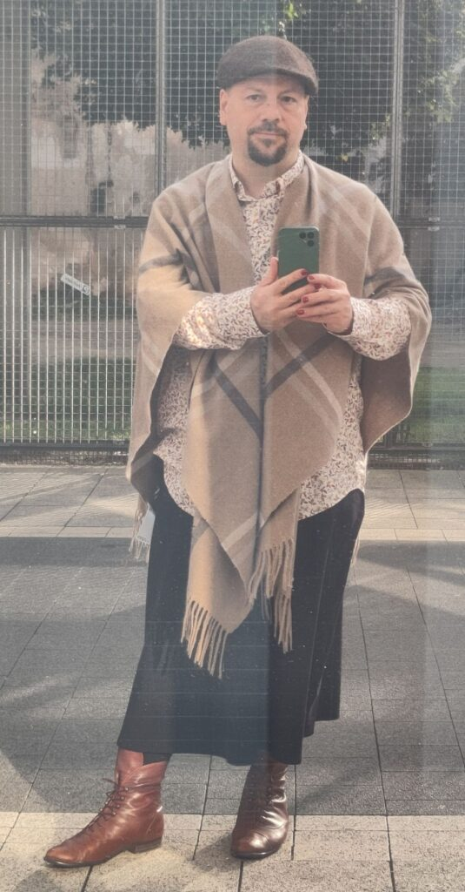
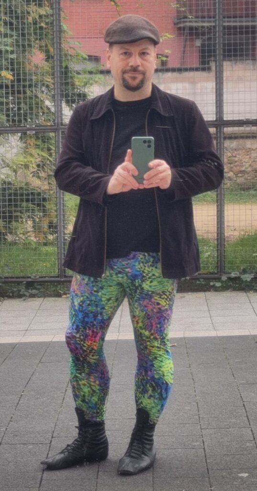

*Today, we welcome Marc from the Rhein-Main area of Germany to [Profiles of Beskirted Men](https://www.the-beskirted-man.com/category/profiles-of-beskirted-men/)!*

**What is your name?**

Marc

**Where are you from?**

I live the Rhein-Main area, but was born and grew up in the north-west of Germany.

**Which types of gender non-conforming clothing do you enjoy wearing?**

Skirts, dresses, leggings, pantyhose, ballet flats, heeled shoes (pumps, booties). But also apart from these obvious gender-nonconforming items, most of my clothes are from the “women’s department” – jeans, trousers, jackets, socks for example.

**When did you start wearing gender non-conforming clothing?**

Early 1990s, when I finished school and moved to another town for studying.

**How did you start wearing gender non-conforming clothing and why?**

When I was a child, there were some cartoon characters that I liked or even envied for their outfits, like Peter Pan or Sindbad the Sailor. Later it was the costumes from the old Robin Hood and pirate movies, or fantasy films like Krull. I wanted those oversized or frilly shirts, leggings, boots or slippers, but never dared to try anything in that direction. Most of all I liked ballet flats, or any kind of soft and foot-hugging shoe, like gymastic slippers or jazz dance shoes.

Moving to another town was very liberating for me. I could try and experiment with my outfits without the “danger” of meeting anyone I know and having to explain anything. I bought colorful leggings, simple black booties, and ballet flats that only barely fit me, because needing shoe size 43 (back then) and having wide feet, there was very little choice in the early 90s. I often wore shoes that were 1 or 2 sizes too small just because I liked them so much or they were discounted and cheap (remember, I was a student at the time).

After graduating, I found a job in Frankfurt. Although I didn’t like the city much at first, it offered even better shopping opportunities. It was the late 90s now, and I remember wearing a lot of skinny jeans, shiny satin or velvet shirts, and men’s heeled shoes (I found 2 pairs back then with chunky 5-7cm heels). That was my everyday style, I also wore it to work. The software business was always quite relaxed about dresscodes, so that was never a problem. I never had to wear a suit or tie to work, and I only ever owned two suits – one of them plain black, bought to wear at my grandma’s funeral.

In the late 90s and early 2000s, I was also quite active on the internet, and there were some online communities of men wearing skirts or pantyhose. It was quite inspiring to find out there are other guys who extend male fashion, and in different ways than I did. Also, the techno/rave movement had many gender-neutral styles, and men’s skirts were sometimes seen on fashion runways and even big clothing stores for a short time.

Since then, skirts have been part of my wardrobe. Some years ago I also started wearing dresses, simple shirt dresses at first, then a bit more tailored ones with wide flaring skirts. Funnily, it was again some TV series that gave me the idea, “Unsere kleine Farm” (Little house on the prairie). When looking at the women and girls there with their long-sleeved, high-neck dresses, I thought – why shouldn’t a man be wearing something similar?

**What is your motivation now for putting on gender non-conforming clothing?**

First, I feel comfortable and myself in my clothing. I do not feel like a stereotypical man. When other men start talking about cars, sports, or barbecue, I just can’t relate. That is not my world and I somehow express this nonconformity in my appearance.

I also feel like I want to be an example of how men can also look like, and that certain items, or colors, or materials should not be limited to women. For me it is part of the long way to gender equality, that clothing choices are free for everyone, and that a man in a dress is just as normal and natural as a woman in trousers.

Finally, the recent rise of right-wing, authoritarian politics and “traditional” gender role models make me wish even more to be different, to reject and defy this trend, to be not like they would like men to be.

**What do gender non-conforming clothes mean to you?**

They are just my clothes. When I browse through a website or catalog, I look at outfits and try to imagine myself in them. That is the only criterium for me now: would something look good on me?

**How often do you wear gender non-conforming clothing?**

Every day. It would be hard for me to put together something with only men’s items. As said above, about 90% of my clothes are “women’s” clothes now. (Some coats and jackets, many shirts, and underwear are the exception)

**Do you go out in public dressed in gender non-conforming clothes? If not, why not? If so, how often and where do you go? Are there any places you wouldn’t go?**

Yes, every day. Supermarket, doctor’s visits, work (I work from home most of the time now, but I also wear skirts etc to the office if I’m there), theater, concerts, restaurants, family meetings.

When there is a new setting or situation, I do tone it down of course, simple black skinny jeans and flats for example.

In my day-to-day life, there are no places I wouldn’t go. But I’m lucky to live in a very diverse muticultural big city.

**Do you find it hard to go out in public in gender non-conforming clothes?**

Not any more. Of course the first years were hard, and it took a lot of courage sometimes. But as I grew older and more experienced and realized that most people don’t care much, my confidence grew and of course it became easier going out then.

**What is your best and/or worst experience in gender non-conforming clothes?**

Best is when I get compliments on the street. That happens mostly when I wear long wide skirts or dresses, maybe because those styles stand out more from the typical male look.

I have never had a really bad experience, like actual threats or violence. Of course sometimes I also hear some rude words or homophobic comments. When that happens (and I feel confident and there are other people around) I usually try to talk and ask what they mean, or why they assume I am gay. Often that is not what they expect 🙂 and the situation ends in a friendly way.

**Do your family or friends know about how you dress?**

Yes, maybe not in every detail or full extent, but definitely yes. Especially my mother is very supporting. Already when I was a child she asked me if I want to try a skirt (which I absolutely didn’t want back then). She is very active in the workers union, cultural societies and women’s movement, and taught me from early age about human rights and equality, and to stand against all kinds of discrimination.

**Are there people you don’t want to know about it?**

No.

**Does your partner accept your clothing choices?**

Yes. Of course she does not like every item or outfit, but not because it is non-conforming, just because it is not her taste.

I have even worn a skirt on our first date. We met through a lonely hearts column in a local magazine, (yes, printed, in 2003) and it seemed to be the easiest way to stand out so she could recognize me. Of course I also used it as a test if she is okay with that 😉

**What is your favorite style?**

At the moment, wide flared skirts or dresses, and flat shoes with them. Or wide-leg cropped pants/culottes with heels. (You see, I never describe what I wear on top. Legwear and footwear are my main focus. I then match the top part to get a good overall look.)

**Where do you shop for your clothes?**

I still go shopping in the city sometimes, and then I find a lot in ordinary stores like C&A, H&M, Kaufhof.

Of course nowadays I find most items online. I shop a lot of clothes at bonprix, Ulla Popken, Happy Size, and shoes at Zalando, or directly at the manufacturers.

The most comfortable ballet flats are from Softstar Shoes in Oregon, US. Their largest size fits me very well and you can choose from a huge selection of colors.

At home (and in dry warm weather also out) I wear gymnastic/ballet slippers from Majestiballerina. They also sell everything in unisex sizes and in many colors and materials.

I also buy (and sell) a lot of shoes on ebay. You can be lucky to find something vintage or deadstock in good condition there.

My current favorite is Etsy. I have found some shops there, most located in eastern Europe,  that make custom-tailored dresses, or made-to-measure shoes. They are quite affordable and make really good items. It takes a few weeks but you do not only get the color and style you want but even the perfect fit, and that at the price you also pay for off-the-rack items in brand stores.

**Is there anything else you would like to add?**

Stop hesitating and go out. Others care much less than you think. Be yourself, it is so very satisfying.

**Do you have any links you would like to share (i.e. social media profiles or websites)?**

I used to have my own website in the 2000s which is long gone now (anyone remember Geocities?). I also used to post on Flickr. But currently I am active on Mastodon and you can see my stuff at [https://mastodontech.de/@nrdblkn](https://mastodontech.de/@nrdblkn).

<figure></figure>

<figure></figure>

<figure></figure>

<figure></figure>

<figure></figure>

<figure></figure>

<figure></figure>

<figure></figure>

<figure></figure>

<figure></figure>

*Thank you for sharing, Marc!*

*If you would like to have your profile featured in [Profiles of Beskirted Men](https://www.the-beskirted-man.com/category/profiles-of-beskirted-men/), take a look at the [post I wrote about it](https://www.the-beskirted-man.com/profiles-of-beskirted-men/profiles-of-beskirted-men/) for more details.*