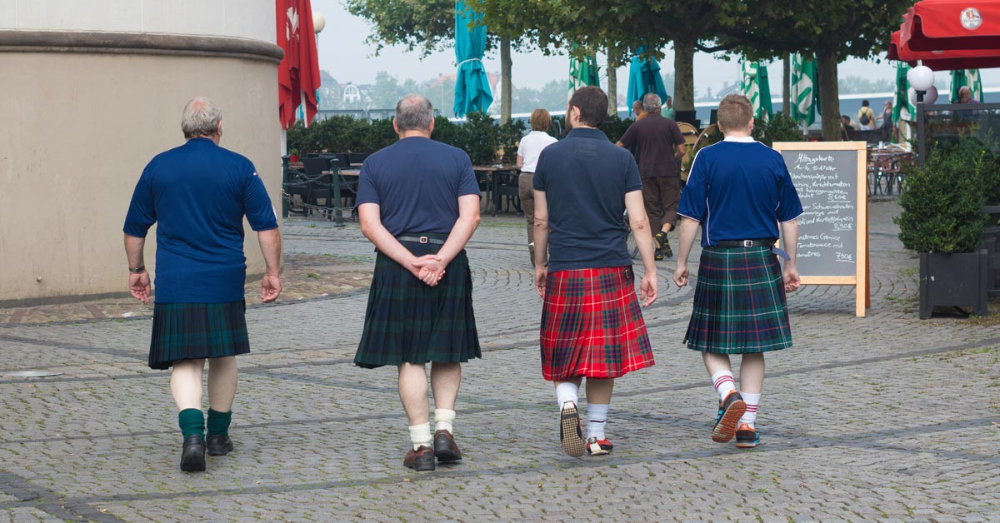

This article goes into a little bit of everything as far as men in skirts goes. It talks about it becoming a new trend, why men stopped wearing skirts, give some styling advice, etc. There is even an FAQ section. While it doesn’t go into much depth in any of those topics, it’s nice that it covers them all.

Men in Skirts — More than a Trend – The Jacket Maker Blog

Men in skirts are quite unusual but in some cultures it is said to be a style statement. They’re becoming possibly one of the most influential fashion trends in modern men’s style.

[https://blog.thejacketmaker.com/men-in-skirts-more-than-a-trend/](https://blog.thejacketmaker.com/men-in-skirts-more-than-a-trend/)