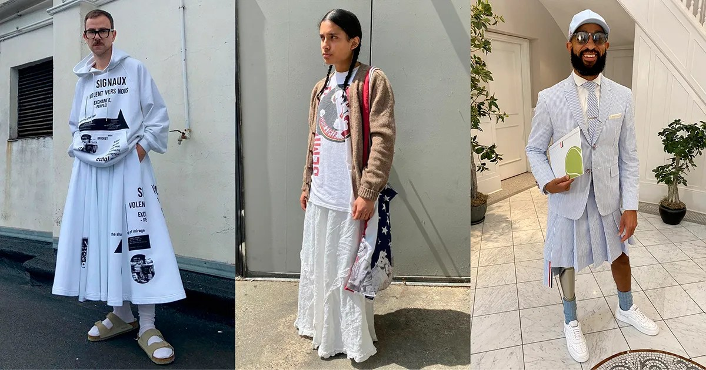

It’s great that Vogue keeps publishing articles about men in skirts, but the fact that this one is from 2021 and makes the claim that “men’s skirts are on the rise” somewhat dubious as it’s still very rare to see. They may be getting more popular, but there is still a long way to go before it can be considered mainstream.

Ready to Try Out a Skirt? 5 Street Style Stars Share Their Favorite Spots

Skirts are going genderless, and these five street style stars rock them like no other.

[https://www.vogue.com/article/skirts-genderless-street-style-stars](https://www.vogue.com/article/skirts-genderless-street-style-stars)