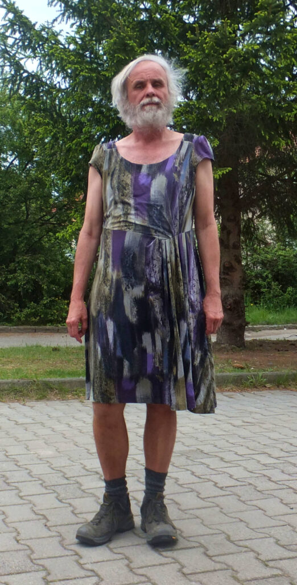
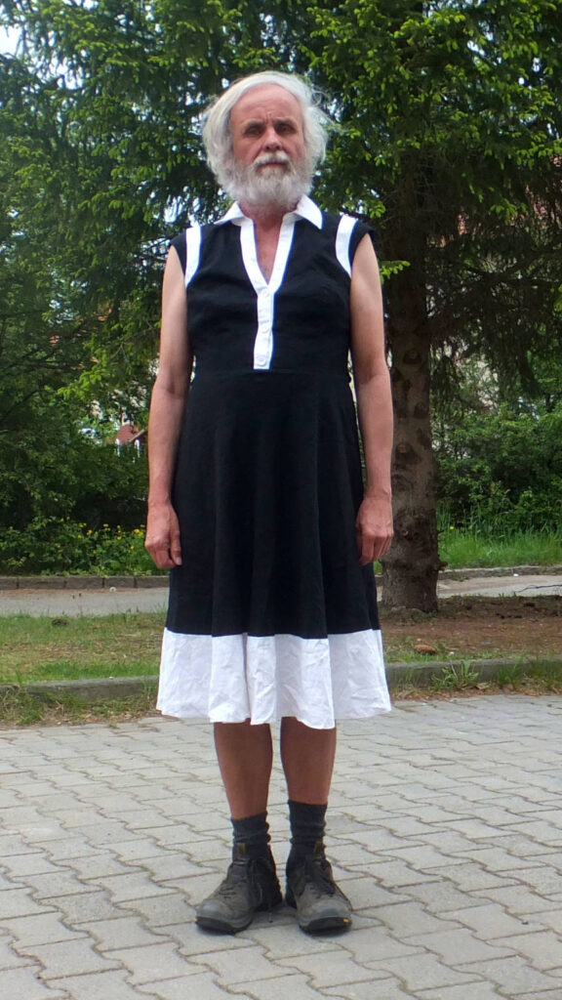
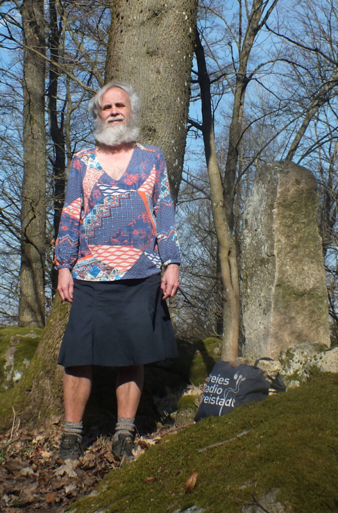

*Today, we welcome Miloš Hlávka from Nový Knín, Czech Republic to [Profiles of Beskirted Men](https://www.the-beskirted-man.com/category/profiles-of-beskirted-men/)!*

**What is your name?**

Miloš Hlávka

**Where are you from?**

Nový Knín, Central Bohemian Region, Czech Republic, Europe, Earth

**Which types of gender non-conforming clothing do you enjoy wearing?**

Skirts, sometimes dresses or some tops.

**When did you start wearing gender non-conforming clothing?**

Privately probably about 2015, publicly in June 2019

**How did you start wearing gender non-conforming clothing and why?**

I have got my first skirt as a present (about 2015), so I started wear it in private (at home, in evening in a lonely forest etc. Then (June 2019) I have bought a Czech clone of kilt ([https://www.kiltzahalka.cz/kilt-po-cesku/](https://www.kiltzahalka.cz/kilt-po-cesku/)) and I started to wear it publicly. I think it was better to let people in neighborhood to be getting used to my skirt wearing little by littlle (because kilts are rare wardrobe in our country, but not “gender non-conforming”). And later I bought and started wearing some other skirts. And this (2025) year also some dresses.

**What is your motivation now for putting on gender non-conforming clothing?**

My first motivation was to try it. And now it is, among other things, an effort to participate in the fact that in the future skirts, etc., on men will not be considered something strange. (As now women in pants also aren’t considered strange.)

**What do gender non-conforming clothes mean to you?**

Comfort, freedom, self-expression, rebellion.

**How often do you wear gender non-conforming clothing?**

Daily.

**Do you go out in public dressed in gender non-conforming clothes? If not, why not?** **If so, how often and where do you go? Are there any places you wouldn’t go?**

Yes, I do. Except in the office (colleagues are a little conservative) almost still.

**Do you find it hard to go out in public in gender non-conforming clothes?**

Every beginning is difficult. But if it succeeds, the result is worth it.

**What is your best and/or worst experience in gender non-conforming clothes?**

The worst experience: Once (2019?) on the Prague underground / subway, someone called me to be ashamed. And I was wearing a kilt, which is usually considered men’s clothing.

The best one: Several times it happened to me that some women told me that I had a nice dress.

One neutral experience: When I was in kilt, people asked me if I was from Scotland. When I started wearing other skirts, they stopped asking. Either they were so shocked that they could not say a word, or they did not even notice that I was wearing a skirt (if it had an inconspicuous color).

**Do your family or friends know about how you dress?**

They must. All town sees it. All town knows it.

**Are there people you don’t want to know about it?**

Maybe…? But it’s “a little” impossible. (All town sees it. All town knows it.)

**Does your partner accept your clothing choices?**

I’m an ace man, so I have no partner.

**What is your favorite style?**

It depends on circumstances.

**Where do you shop for your clothes?**

Mostly in second hand shops. My favorite is this: [https://profi-sh.cz/prodejny/7\_pisek/](https://profi-sh.cz/prodejny/7_pisek/)

**Is there anything else you would like to add?**

I wish everyone to survive these strange times and to do something for it.

**Do you have any links you would like to share (i.e. social media profiles or websites)?**

My personal blog: [https://miloshlavka.wordpress.com/](https://miloshlavka.wordpress.com/) , my blog about our town: [https://novyknin.wordpress.com/](https://novyknin.wordpress.com/) – both in the Czech language.

And me on the Steyr Pride 2024: [https://e-steyr.com/fotos/event/SteyristPRIDE224#gid=gallery0b908f9fee73d03e7efb334aaeacf7cf&pid=52441](https://e-steyr.com/fotos/event/SteyristPRIDE224#gid=gallery0b908f9fee73d03e7efb334aaeacf7cf&pid=52441) (in front of the entrance of the St. Michael Church in Steyr, Austria).

<figure></figure>

<figure></figure>

<figure></figure>

*Thank you for sharing, Miloš!*

*If you would like to have your profile featured in [Profiles of Beskirted Men](https://www.the-beskirted-man.com/category/profiles-of-beskirted-men/), take a look at the [post I wrote about it](https://www.the-beskirted-man.com/profiles-of-beskirted-men/profiles-of-beskirted-men/) for more details.*