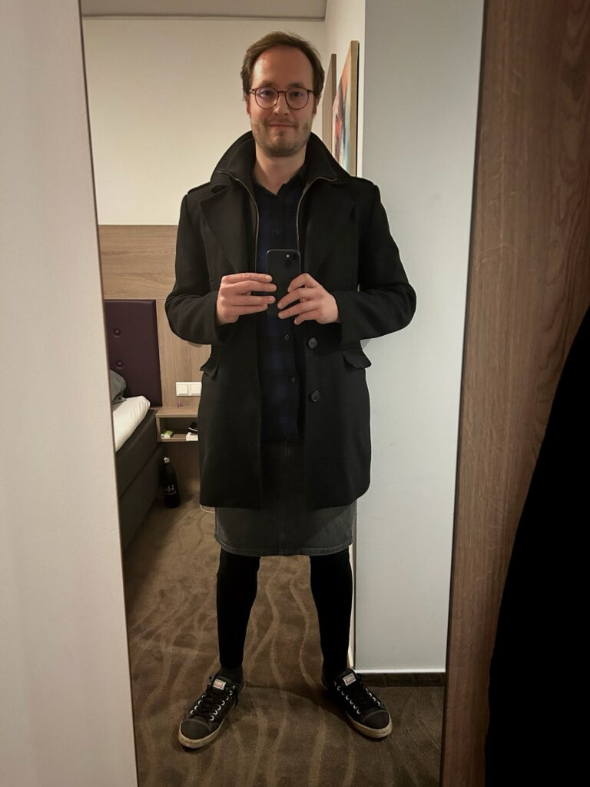

As those of you who follow me on [Instagram](https://www.instagram.com/p/DBeo4GTuNTN/) have probably already seen, I wore a skirt to the office for the very first time last week on October 23, 2024. The photos in this post show the outfit I wore that day and were taken back at the hotel afterward. I work remotely because the office is about 200 km (about 125 miles) away from where I live which means I am rarely there.

I have written [about wearing heeled boots to the office](https://www.the-beskirted-man.com/personal-experiences/heeled-boots-at-the-office/) before, but I had never actually worn a skirt which is significantly less subtle. Given that I might visit the office twice a year, I don’t have a lot of opportunity and when I’ve been there, I haven’t felt entirely comfortable with wearing a skirt because I don’t know the people very well. Everyone I work with on a daily basis also works remotely, so most of the regular office-dwellers are unfamiliar faces to me.

This time was different though. While I still didn’t really know anyone, I was there to attend a training seminar for software architecture which meant I got to know the group I was with fairly well after only a couple of days. By Wednesday, I decided I was comfortable enough to break out my gray denim skirt and black cotton leggings as you can see from the pictures above and below.

It goes without saying that I was incredibly nervous despite all of my experience wearing skirts out in public since this was a situation that involved my employer and coworkers rather than random people on the street. Leaving my hotel room, I headed down to the breakfast room which is where I ran into a couple of the other attendees of the seminar who also work remotely. I got my breakfast, sat down and chatted with them while eating. Not a single word was mentioned about my choice of dress which helped me relax about the situation.

We then drove over to the office building together. Walking inside, we hiked up the stairs to the fifth floor where the office is. Even though some of the group was behind me and most certainly couldn’t have missed the fact that I was wearing a skirt, no one said a word and absolutely nothing changed in our interactions whatsoever.

Once in the office, we headed for the conference room where the seminar was taking place. The teacher was there and so was the rest of the group. People looked at me and the others as we entered the room but in exactly the same way they would have if I had been wearing jeans or slacks.

It won’t come as a surprise to most of you who have read about my experiences wearing skirts in public that not a single person mentioned my skirt or treated me any differently throughout the entire day. It was exactly the same as though I had been wearing bottoms you would find in the men’s department.

The only odd looks I got were from a couple of older ladies at the restaurant where we went to eat for lunch. They were very openly staring at me and whispering to each other which is the sort of scenario that rather amuses me since they had probably never seen a man wear a skirt before.

After a long day at the office, I drove back to the hotel with my coworkers and we went our separate ways for a couple of hours until we decided to meet up for dinner. I stayed in my skirt and we had a great meal at a Vietnamese restaurant that we walked to on a major road. Again, absolutely nothing happened.

My skirt wasn’t brought up even once. They never looked at me strangely, never treated me any differently and were just as friendly and professional as before. In fact, they were much more interested in the fact that I was American which seems to fascinate a lot of Germans since I speak German fairly well.

All in all, the experience was exactly as I had thought it would be: entirely anticlimactic. No one cares what you wear as long as it is context-appropriate. For better or worse, I still probably wouldn’t wear a skirt when visiting one of my company’s customers since it may, unfortunately, still have an indirect impact on my company, but I will absolutely wear a skirt again when I visit the office in the future.

<figure></figure>

<figure></figure>