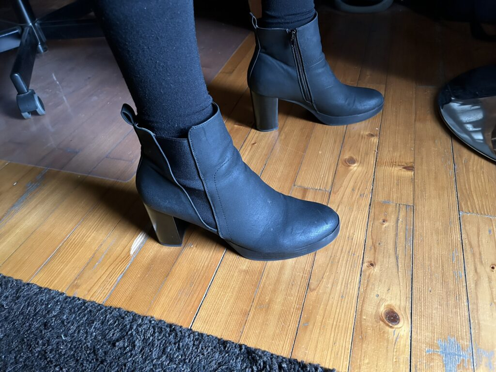
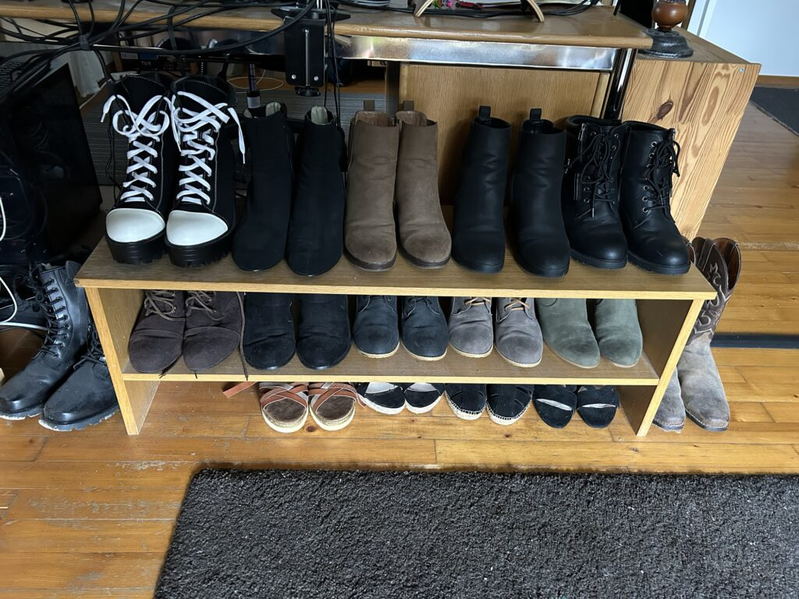

This is going to be a pretty short post because it is primarily an anecdote about something my son has started doing. At almost two years of age, he has already developed a strong interest in his surroundings and has been exploring every aspect of it. That includes the shoe rack I have in my office at home which contains most of my high-heel shoe collection (see the photo of it below).

At one time or another, he has pulled out every shoe on it and tried to put his foot in it. Since I wear a size 13 US (46 EU), not only will his entire foot fit in it, but also most of his leg. However, for some reason, he has taken a particular liking to a black pair of heeled boots I have from Anna Field (see the photo of them both below and above).

He pulls these off the rack daily and carries them around with him. I haven’t been able to figure out why since I don’t wear them and more or less than any of the others, but I do find it amusing. I suppose he is already developing preferences and his taste in fashion. Occasionally, he gets frustrated when trying to put them on because he can’t get up when his legs are entirely buried inside them. I find it amusing.

However, in lieu of him not being able to wear them himself, he thoroughly insists that I wear them more frequently than I otherwise would. That comes in the form of bringing them to me, dropping them at my feet and saying “put on”. If I refuse, he gets upset. Once I do put them on though, he will get upset if I take them off which means my wife has started asking me if I am trapped in my boots again if she sees me wearing them.

While it’s become a running gag between us that I am trapped in my boots again, there is a certain truth to it in that there are consequences if I take them off: a crying child. I don’t wear them for long if I really don’t want to, but usually, I don’t mind humoring him at least a little bit.

All in all, I find the situation rather amusing, but there is also something important that deserves to be pointed out. My son’s behavior shows the innocence of such a young child and the fact that he hasn’t yet been socialized to believe men wear certain clothes while women wear others. There is nothing “natural” about men wearing bifurcated bottoms and flat shoes while women get to wear skirts, dresses and heels. It’s entirely learned and is something that can absolutely be changed.

<figure></figure>

<figure></figure>