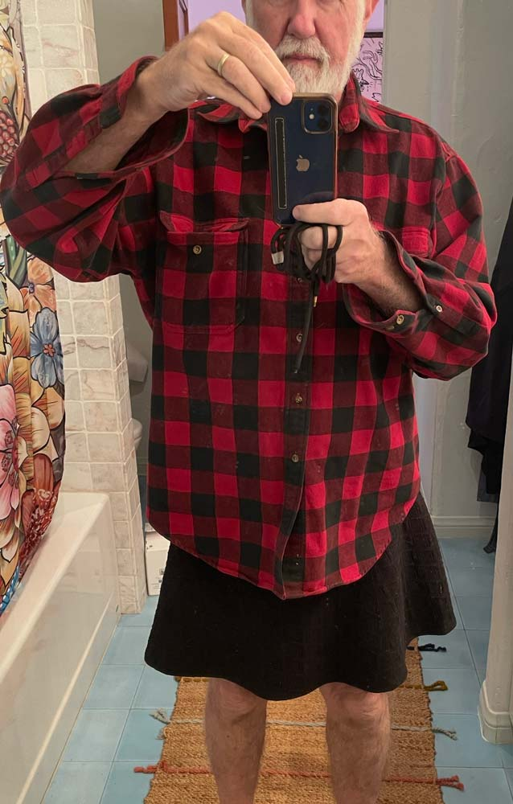

*Today, we welcome Paul R from Los Angeles, California, USA* *to [Profiles of Beskirted Men](https://www.the-beskirted-man.com/category/profiles-of-beskirted-men/)!*

**What is your name?**

Paul R.  I am a 70 year old married man.  I live in a house secluded from my neighbors in Los Angeles, California, USA

**Which types of gender non-conforming clothing do you enjoy wearing?**

Skirts, kaftans, wrap skirts, leg warmers, utilikilts.   Recently (now in winter) I’ve been exploring tights and leggings.  I’ve found crotchless styles to be most comfortable giving me the freedom I so enjoy.

****How did you start wearing gender non-conforming clothing and why?****

I first started with utilikilts, prepping for burningman maybe 15 years ago.  I totally felt comfortable wearing them to homedepot or doing errands. (in the summer).  I found that I really like long t-shirts, also called nightshirts.   Then I got kaftans, tunic dresses, or simple costume tunics.  About two years ago I fell in love with wrap skirts.  I found real simple terry cloth wraps on amazon.  I learned how to do simple sewing and made my own, including pockets.  Next I found skirts at thrift stores.  I like short (mini) black ones with plenty of elastic.   I have about 20 or more of these.  They are cheap and if they don’t fit, I just give them back.  My only complaint is lack of pockets.   Utilikilts have pockets but are very bulky.

On a side note, I’m somewhat a nudist.  I’d go completely nude, but good nudist etiquette means you always place a towel down before sitting down.  So by wearing a skirt, I avoid the towel thing.   Also if people come to the house, like delivery guys I am covered. I also wear skirts commando style.  I’m into the simplicity and thus underwear do not fit into the picture.  I’m retired so I’m at home a lot.  I rarely stand up to pee, and thus I really enjoy the simplicity of sitting the toilet.

**What is your motivation now for putting on gender non-conforming clothing?**

I don’t think of it as non-conforming clothing, except with dealing with other people’s perception.   If my wife can wear pants, why can’t I wear a skirt?   I give myself the freedom to wear what feels good for me.  I’m 70 and desire to live the rest of my life without worrying about thinking about what others think of me.  

**Do you go out in public dressed in gender non-conforming clothes? If not, why not?** **If so, how often and where do you go? Are there any places you wouldn’t go?**

Although I feel free to wear what I want, I do sense it’s easier to conform in many situations.

I wear skirts every day I am at home.   Occasionally I wear skirts or wraps out, but usually nothing above the knee.   My wife will go out with me to dinner, only if I look good, and I have just a few wraps that pass that test.  Then I do notice people looking, but that’s OK, whatever.

When I go on vacation (to the beach) I never wear pants the whole trip.  I have even used a spandex skirt as a bathing suit.  What freedom and it feels so good. My dream is to wear mini skits playing pickleball or riding a bike.  Outside of places like burningman or nudist resorts, I don’t see that happening in my lifetime.

**Do you find it hard to go out in public in gender non-conforming clothes?**

Yes, initially.  But once I’m out and doing it, it gets easier and more empowering as the day or night goes on.  The bigger issue for me is with friends and neighbors.  Some people are open and excepting, and others not so much.   So I’m carful to not freak out people I want as friends.   I think I’ve gone too far in some cases, and too restrictive in other cases.   Neighbors talk you know.

**What is your best and/or worst experience in gender non-conforming clothes?**

I’ve gotten a number of compliments which is reaffirming.   Never had really bad experiences, but then maybe I’ve been too careful.

**Do your family or friends know about how you dress?**

Family no.   Some friends.   Wife has come around to acceptance, she just wants me to have style and look good.  She will buy me clothes if she thinks I look good in.   She will tell her friends, which seems she is releveling too much, but in retrospect I appreciate her putting it out there, which I am reluctant to do.

**What is your favorite style?**

For me its about comfort and simplicity.  I don’t care if people think I’m masculine or feminine.  I’m me!  I really like the mini skirts.  I don’t care if my junk shows.  I think if I was a woman I would wear them all the time.   But I get for a woman, that phase ended in their teens or early 20s when they got tired of the unwanted attention.  

**Where do you shop for your clothes?**

I like getting clothes from thrift shops, where it’s not a big deal if it fits or not.   I can do some on internet, but more expensive and not a sure fit.   I’ve yet to do retail shopping.  I’ve yet to explore the world of gay fashion, which I think might be more in line with my and my wife’s tastes.    I’m also big on alterations I do with the sewing machine.

**Is there anything else you would like to add?**

It’s clear to me by reading some of the other profiles, there are mainly two camps.   Those of the fascination with feminine clothing and cross dressing.  And then others that don’t care about masculine or feminine, and just like what feels good.  I’m solidly in the second camp, although in my earlier years I was fascinated by the feminine.   The other thing that influences me is my wife’s desirers.  She wants me to be the Marlboro Man which I get.   I might want to make a case with her that I should wear what I want, except that I have ideas of how I want her to dress, so it’s a compromise.   I want her to wear feminine dresses and skirts, which is more important to me than me being skirted.  

<figure><figcaption>Profiles of Beskirted Men: Paul R</figcaption></figure>

*Thank you for sharing, Paul R!*

*If you would like to have your profile featured in [Profiles of Beskirted Men](https://www.the-beskirted-man.com/category/profiles-of-beskirted-men/), take a look at the [post I wrote about it](https://www.the-beskirted-man.com/profiles-of-beskirted-men/profiles-of-beskirted-men/) for more details.*