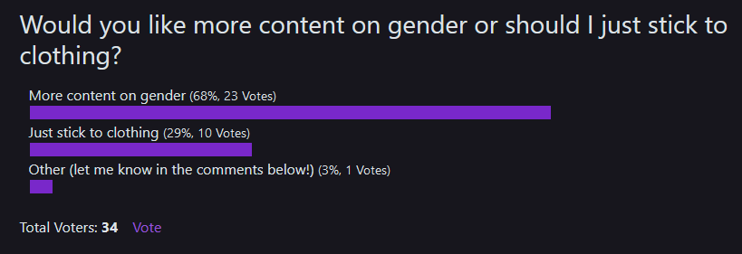

A few weeks ago, [I posted a poll](https://www.the-beskirted-man.com/polls/poll-would-you-like-more-content-on-gender-or-should-i-just-stick-to-clothing/) that asked the question of whether or not I should write more about gender-related content rather than just sticking to the regular program of skirt-related stories and experiences.

Since there was a lot of discussion about it on both [the post itself](https://www.the-beskirted-man.com/polls/poll-would-you-like-more-content-on-gender-or-should-i-just-stick-to-clothing/) as well as on [Instagram](https://www.instagram.com/thebeskirtedman/), I thought I would post about the results of the poll as of today, November 9th, 2024. The poll is still open, so it may still change, but here is a screenshot of how it looks as I’m writing this:

<figure><figcaption>Results of the Gender Poll as of November 9, 2024</figcaption></figure>

It would appear that most of you are ***for*** me posting more gender-related content which I am happy to do. I have several ideas for posts that address gender-related issues and also about how they relate to gender-non-conformity in clothing.

Of course, I still have plenty of other experiences and posts about other topics to write as well, so you don’t have to worry about the focus of this blog shifting. Gender will just be an additional topic I will include.

I’m looking forward to reading about what you think about the content and, as always, will be open to any feedback and discussion about it.