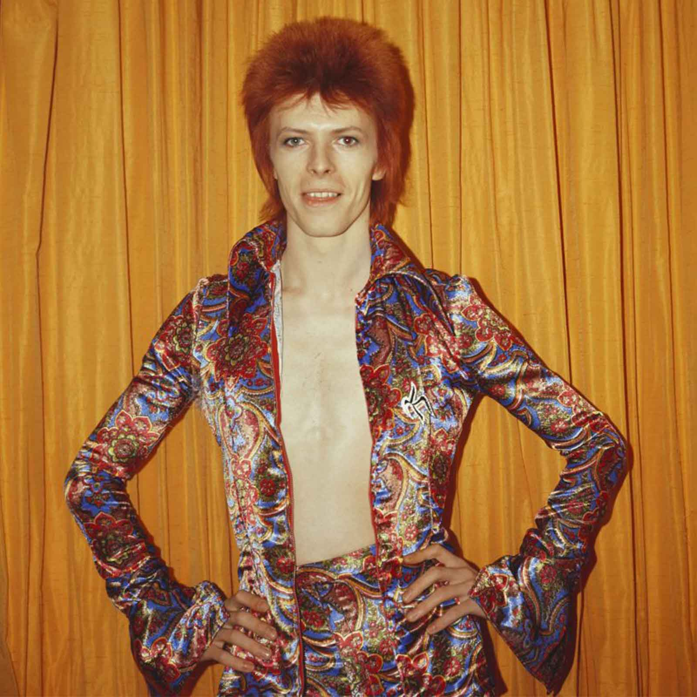

This article from Esquire has been making the rounds recently and I thought it was very interesting. It discusses some of the previous movements for genderless fashion, particularly as it pertains to men wearing what is generally considered to be women’s clothing.

Sharp Dress, Man

Attempts to erase the barriers between attire for a man and a woman aren’t new. Can we finally get a true fluidity in the way we all dress?

[https://esquiresg.com/sharp-dress-man-gender-fluidity-fashion/](https://esquiresg.com/sharp-dress-man-gender-fluidity-fashion/)