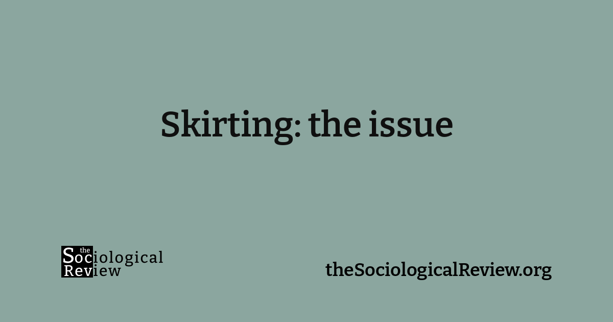

This is an interesting article that discusses men wearing “women’s” clothing such as skirts and heels to work as well as addressing heteronormativity. [Mark Bryan](https://www.instagram.com/markbryan911/) is cited as an example of how well that can work despite it being somewhat abnormal.

Skirting: the issue: Do queered clothes still make the man?

Be confident in what you wear – inverting norms widens horizons. But, asks Briony Lipton, why should men fear to tread a path worn by women?

[https://thesociologicalreview.org/magazine/june-2022/clothes/skirting-the-issue](https://thesociologicalreview.org/magazine/june-2022/clothes/skirting-the-issue)