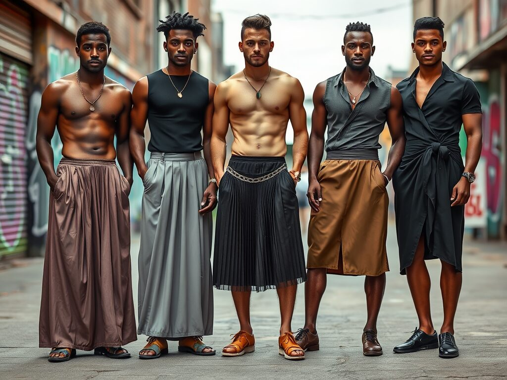

This is a fairly generic post about men wearing skirts and the different type of skirts that men typically wear. It won’t be very exciting for men who are a bit more well-versed in the topic, but may be a great starting point for those who are looking to get started wearing skirts.

Skirts for Men: Redefining Style, Comfort, and Cultural Expression in Modern Fashion

Skirts for men have been part of human culture for centuries. Scottish kilts are among the most famous, symbolizing heritage and pride.

[https://newpape.com/skirts-for-men](https://newpape.com/skirts-for-men)