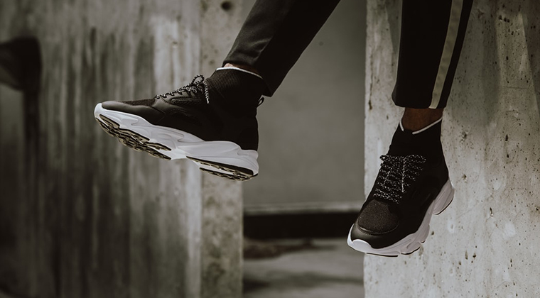

This article presents the results of a study that shows that almost half of all men regularly wear women’s fashion. It also discusses some of the reasons they do as well as which age groups do it the most.

Study reveals that 2 in 5 men regularly wear women’s fashion – Wellbeing Magazine

41 per cent of men regularly include clothing designed for women into their wardrobes, a new study of 2,000 men has found.

[https://wellbeingmagazine.com/study-reveals-that-2-in-5-men-regularly-wear-womens-fashion/](https://wellbeingmagazine.com/study-reveals-that-2-in-5-men-regularly-wear-womens-fashion/)