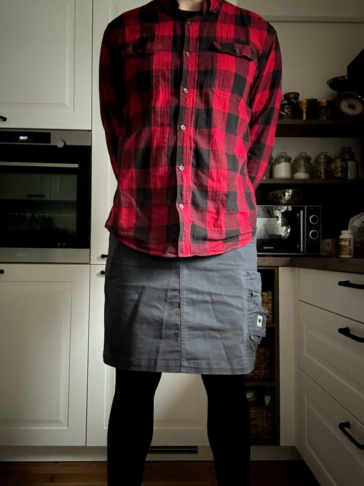
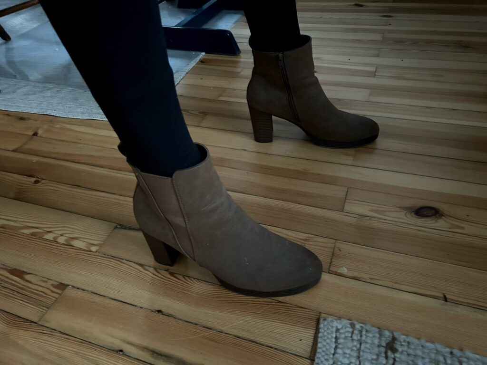

It’s been a while since [my last outfit post](https://www.the-beskirted-man.com/outfits/tan-blue-and-black-a-masculine-combination/) and this one features one of my all-time favorite outfits which I have lovingly dubbed “The Beskirted Lumberjack”. Based on the feedback you guys gave me on my last outfit post, I have included better photos this time which you will find at the bottom of the post.

The prominent feature of this outfit is a button-down shirt with large red and black checkers. It is a bold and bright shirt that couldn’t be more of a stereotype of typical “masculine” clothing in Western cultures. I like to pair it with one of my black skirts and either black thermal tights or cotton leggings depending on how cold it is.

In the photos below, I am wearing it with my [black skirt from Engelbert-Strauss](https://www.engelbert-strauss.de/en/womens-tabards-aprons/skirt-e-s-motion-ten-ladies-3161420-66206-1200.html?itemorigin=SEARCH) and with black cotton leggings which I find more comfortable than tights. Also in the photos below, you will notice I am wearing [my brown heeled boots from Anna Field](https://www.zalando.de/anna-field-ankle-boot-cognac-an611n0bz-o11.html). I like to wear brown boots with the outfit, but will sometimes wear black instead. I have the same boots in black.

I have worn this outfit sans heeled boots in public many times and have never had anyone comment on it. I tend not to wear heeled shoes out because at 191 cm (6′ 2″) without heels, I already have difficulties fitting into things without heels. Instead, I will wear flat boots or my sneakers.

The outfit as shown consists of the following components:

-   Red and black checkered shirt from Walmart
-   [The black skirt from Engelbert-Strauss](https://www.engelbert-strauss.de/en/womens-tabards-aprons/skirt-e-s-motion-ten-ladies-3161420-66206-1200.html?itemorigin=SEARCH)
-   [Brown heeled boots from Anna Field](https://www.zalando.de/anna-field-ankle-boot-cognac-an611n0bz-o11.html)
-   Black, cotton leggings

<figure></figure>

<figure></figure>

*What do you think about the outfit? Would you change something about it or keep it the way it is? Let me know in the comments below!*