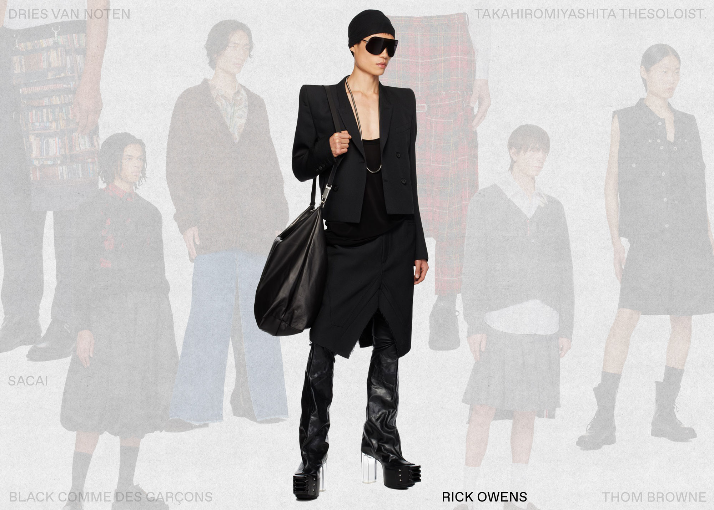

I find articles like these tricky. Every individual has their own sense of fashion, no matter how boring or creative which makes making bold claims about the best skirts (or anything else) for guys difficult to say the least.

That said, it’s still good to see advice out there, particularly for men who are just getting started on their beskirted journeys. There are so many different styles of skirts out there that it can be intimidating at first, so finding a good starting point is important.

The recommendations in this article look a bit too much like they just came off the runway for me, but others may find them inspiring.

THE BEST SKIRTS FOR GUYS

Skirts are for everyone, and here are 7 of the best skirts for men to wear in 2024.

[https://www.ssense.com/en-us/editorial/market/best-skirts-for-men](https://www.ssense.com/en-us/editorial/market/best-skirts-for-men)