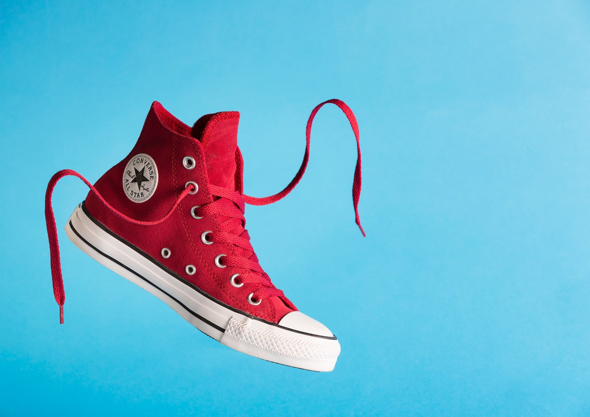

This is an incredibly fascinating topic that certainly deserves its own post on this blog (hint: I am going to write about it).

There was a study done by the Harvard Business School that shows that people who break fashion norms are often perceived as having a higher status because it exudes confidence. They tested it using bright red sneakers, hence the name, and since it was performed by the Harvard Business School, their primary focus was of course on business contexts. However, this psychological effect could absolutely benefit men wearing skirts and other gender-non-conforming clothing.

I have actually included multiple links here. The first is to a journalistic article written about it that might be a little quicker and easier to digest than the actual study. The others are to the actual study itself.

**The article:**

The Red Sneakers Effect and The Psychology of Distinctiveness in Marketing — Neuroscience Of

What is the Red Sneakers Effect? Willingly breaking social conventions is a symbol of high status. Marketers can benefit from understanding this element of consumer psychology, and can apply it to optimizing for the psychology of distinctiveness. Elements that are distinct will stand out and will be

[https://www.neuroscienceof.com/branding-blog/psychology-distinctiveness-richard-shotton-red-sneakers-effect](https://www.neuroscienceof.com/branding-blog/psychology-distinctiveness-richard-shotton-red-sneakers-effect)

**The study:**

-   Abstract and author information: [https://www.hbs.edu/faculty/Pages/item.aspx?num=45809](https://www.hbs.edu/faculty/Pages/item.aspx?num=45809)
-   The actual study as a PDF: [https://www.hbs.edu/ris/Publication%20Files/The%20Red%20Sneakers%20Effect%202014\_4657b733-84f0-4ed6-a441-d401bbbac19d.pdf](https://www.hbs.edu/ris/Publication%20Files/The%20Red%20Sneakers%20Effect%202014_4657b733-84f0-4ed6-a441-d401bbbac19d.pdf)