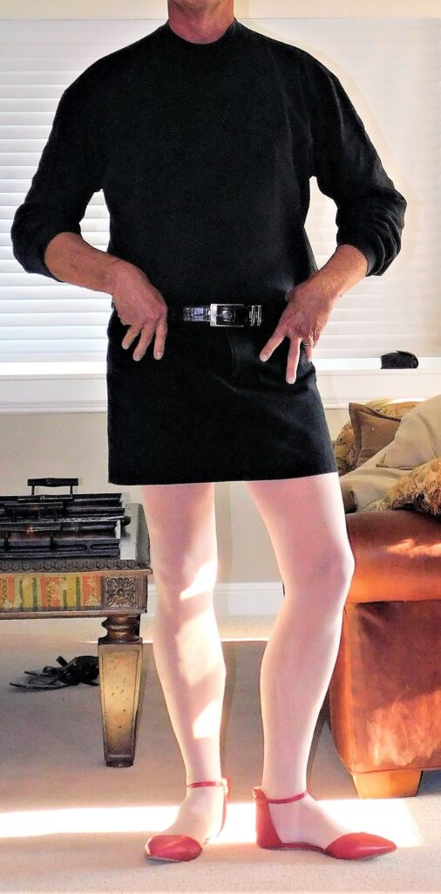
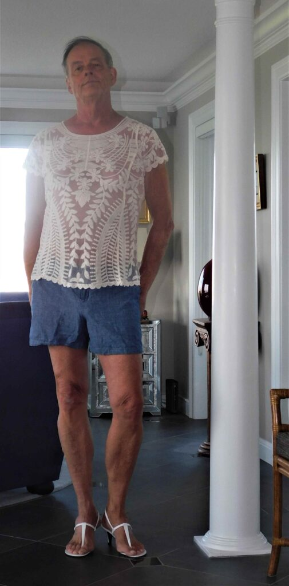
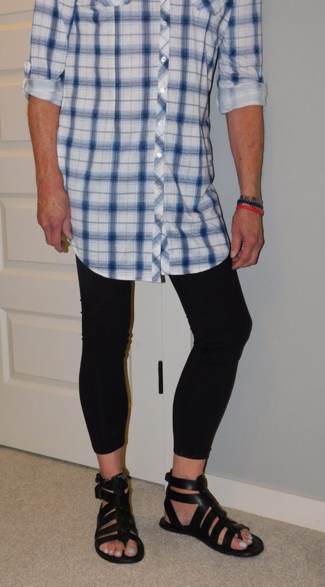
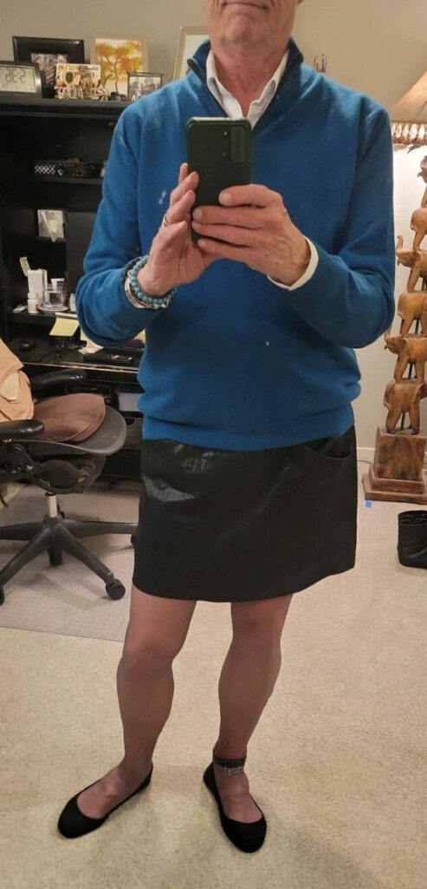

*Today, we welcome Tommy J from Portland, Oregon to [Profiles of Beskirted Men](https://www.the-beskirted-man.com/category/profiles-of-beskirted-men/)!*

**What is your name?**

Tommy J

**Where are you from?**

Portland, Oregon

**Which types of gender non-conforming clothing do you enjoy wearing?**

skirts, leggings, ballet flats, strappy sandals, sundress

**When did you start wearing gender non-conforming clothing?**

age 11. my aunt is only a few years older than I am and when she went off to college she left behind most of her summer clothes and I tried every one of them on…over and over. then a family moved in next door and their daughter, Carole, and I were the same size and we tried on one another’s clothes. sadly, I could not wear her shoes.

**How did you start wearing gender non-conforming clothing and why?**

I had a trove of my aunt’s clothes to play with. initially, I got hard when trying them on, but as I aged I realized clothes are fabric and fabric is unisex. so wear whatever you want, wherever you want and whenever you want. like my manicurist told me when I was 30 and got my first mani/pedi: “it’s just paint”. clothes are just fabric so wear what you like and what makes you feel good.

**What is your motivation now for putting on gender non-conforming clothing?**

comfort and style

**What do gender non-conforming clothes mean to you?**

I live in the Pacific Northwest. it is a very liberal place and here there are literally thousands of people who cross gender lines. I am a guy. want to be a guy. not into wigs and makeup and breast forms. but I do love “women’s” clothing made from fabric that was intended to be worn by women and women only. but spend some time in a skirt or leggings and a pair of ballet flats and you will soon understand why women are always looking like that and enjoying the comfort built into most womens clothes.

**How often do you wear gender non-conforming clothing?**

pretty much every day I have on something made for women.

**Do you go out in public dressed in gender non-conforming clothes? If not, why not?** **If so, how often and where do you go? Are there any places you wouldn’t go?**

I do to some extent. I have worn a kilt out and spend much winter time in leggings and go out running errands looking like virtually every woman I come into contact with. they have it figured out. comfort, looks, style. men are hogtied by machismo and mostly think they could never be caught dead in a comfy skirt and some t-strap thong sandals. they are missing out. period.

**Do you find it hard to go out in public in gender non-conforming clothes?**

no, not here in Portland

**What is your best and/or worst experience in gender non-conforming clothes?**

I have been praised and heckled. mostly praise, thankfully. and most of that comes from women

**Do your family or friends know about how you dress?**

some do

**Are there people you don’t want to know about it?**

yes

**Does your partner accept your clothing choices?**

yes

**Where do you shop for your clothes?**

mini skirt, sleeveless shirt, strappy flat sandals (nails painted, of course!)

**Do you have any links you would like to share (i.e. social media profiles or websites)?**

[torrid.com](http://torrid.com)

I buy shoes from them. cross-gender styles (flats, sandals, chelsea boots, cage-sandal heels, slides, clogs) and made big enough for most all men to enjoy. I have 13 pairs from Torrid and love them all! I wear a man’s 10.5 and have found that 11.5 from Torrid works perfectly for me.

<figure></figure>

<figure></figure>

<figure></figure>

<figure></figure>

<figure></figure>

<figure></figure>

<figure></figure>

<figure></figure>

<figure></figure>

*Thank you for sharing, Tommy J!*

*If you would like to have your profile featured in [Profiles of Beskirted Men](https://www.the-beskirted-man.com/category/profiles-of-beskirted-men/), take a look at the [post I wrote about it](https://www.the-beskirted-man.com/profiles-of-beskirted-men/profiles-of-beskirted-men/) for more details.*