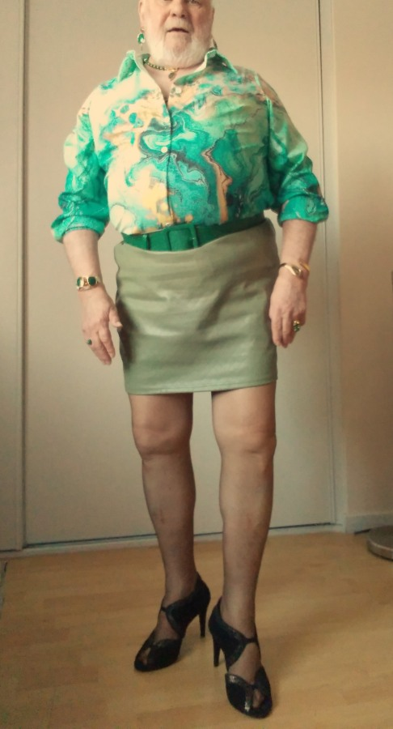
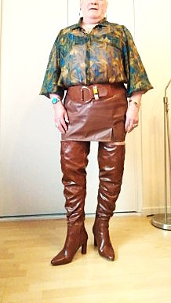
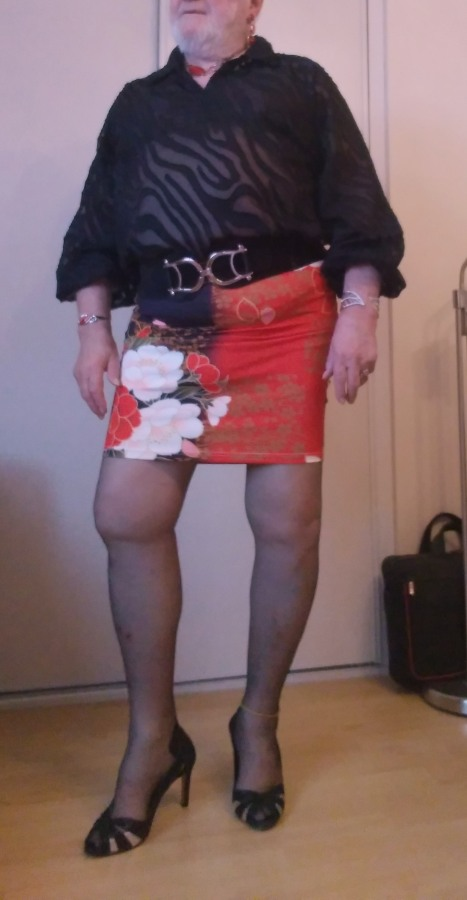

*Today, we welcome Tongim from France to [Profiles of Beskirted Men](https://www.the-beskirted-man.com/category/profiles-of-beskirted-men/)!*

*Note from the editor: The original answers were given in French and are included below. The English translations were done through Google Translate.*

**What is your name?**

Tongim

**Where are you from?**

France

**Which types of gender non-conforming clothing do you enjoy wearing?**

je porte de la lingerie , des bas nylon avec porte-jarretelles, des jupes crayon ou trapèze, des robes , des talons de tout types , des bijoux et de temps en temps du vernis à ongles .

*I wear lingerie, nylon stockings with garter belts, pencil or trapeze skirts, dresses, heels of all types, jewelry and from time to time nail polish.*

**When did you start wearing gender non-conforming clothing?**

dès l’adolescence la lingerie, mais je porte régulièrement des vêtements féminins depuis 5 ans

*lingerie since adolescence, but I have been wearing women’s clothing regularly for 5 years*

**How did you start wearing gender non-conforming clothing and why?**

jeune en empruntant la lingerie de ma soeur, maintenant en me procurant mes propres vêtements et effets féminins

*young by borrowing my sister’s lingerie, now by getting my own clothes and feminine belongings*

**What is your motivation now for putting on gender non-conforming clothing?**

je me sens à l’aise et moi-même en les portant

*I feel comfortable and myself wearing them*

**What do gender non-conforming clothes mean to you?**

le reflet de ma personnalité féminine

*the reflection of my feminine personality*

**How often do you wear gender non-conforming clothing?**

quotidiennement

*daily*

**Do you go out in public dressed in gender non-conforming clothes? If not, why not?** **If so, how often and where do you go? Are there any places you wouldn’t go?**

Oui je sors habillée de temps en temps lors de voyages en voiture ou dans des villes autres que mon village, je me rends également pour des ssayages et retouches chez ma couturière en toute confiance .

*Yes, I go out dressed from time to time when traveling by car or in cities other than my village, I also go to my seamstress for fittings and alterations with complete confidence.*

**Do you find it hard to go out in public in gender non-conforming clothes?**

j’ai du mal à sortir dans mon village et avec mon entourage familial

*I have difficulty going out in my village and with my family.*

**What is your best and/or worst experience in gender non-conforming clothes?**

Mon plus grand plaisir a été lors d’une sortie dans uns ville voisine pour aller au bureau de poste marchant sereinement dans la rue . Et également la découverte par mon médecin rythmologue de mon soutien-gorge lors d’une consultation

*My greatest pleasure was during an outing in a neighboring town to go to the post office, walking serenely down the street. And also the discovery by my rhythm doctor of my bra during a consultation.*

**Do your family or friends know about how you dress?**

Ma soeur, ma compagne, et quelques connaissances

*My sister, my partner, and some acquaintances*

**Are there people you don’t want to know about it?**

non ça ne me gêne pas que les gens le voit ou le sache, ma limite est de ne pas gêner les gens qui m’entourent s’il ne l’acceptent pas

*No, it doesn’t bother me if people see it or know it, my limit is not to bother the people around me if they don’t accept it.*

**Does your partner accept your clothing choices?**

Non ma compagne n’apprécie pas mais elle le tolère à condition d’être discrète dans le cadre familial et en public

*No, my partner doesn’t like it, but she tolerates it as long as she is discreet within the family and in public.*

**What is your favorite style?**

Robes légères, jupes/chemisiers ( mêmes transparents ), bas, talons et bijoux ( bagues, bracelets, colliers et boucles d’oreilles

*Light dresses, skirts/blouses (even transparent ones), stockings, heels and jewelry (rings, bracelets, necklaces and earrings)*

**Where do you shop for your clothes?**

Essentiellement en ligne car j’habite dans un petit village sans boutiques

*Mainly online as I live in a small village with no shops*

<figure></figure>

<figure></figure>

<figure></figure>

*Thank you for sharing, Tongim!*

*If you would like to have your profile featured in [Profiles of Beskirted Men](https://www.the-beskirted-man.com/category/profiles-of-beskirted-men/), take a look at the [post I wrote about it](https://www.the-beskirted-man.com/profiles-of-beskirted-men/profiles-of-beskirted-men/) for more details.*