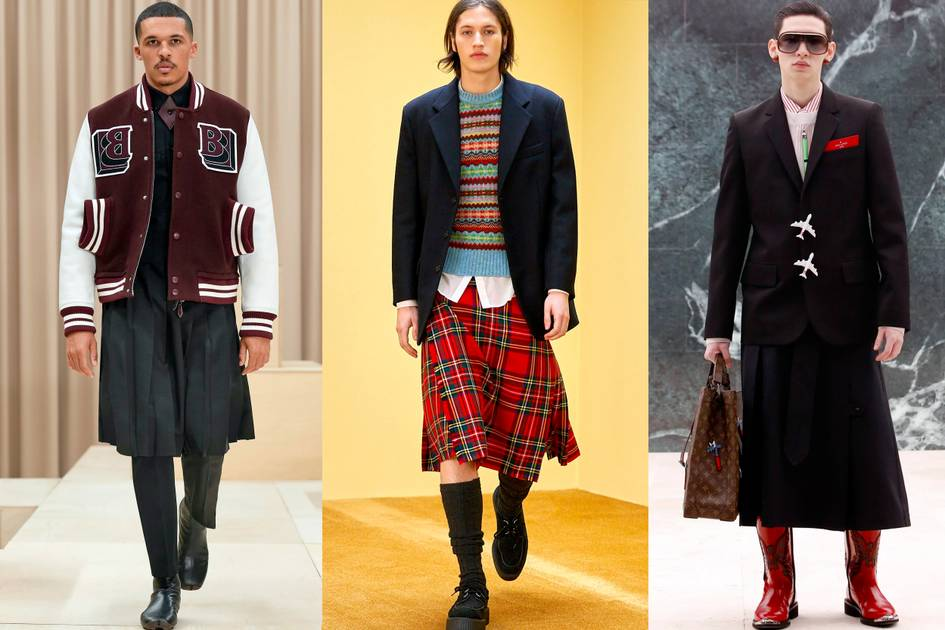

FashionUnited reports here on the trend of men wearing skirts in modern fashion and predicts that “the idea of the man skirt or kilt growing exponentially each season.”

Tracing a trend: men in skirts

Image: Burberry/Molly Goddard/Louis Vuitton Men wearing skirts is commonplace in certain countries including Fiji, Myanmar and Bhutan. In Greec

[https://fashionunited.uk/news/fashion/tracing-a-trend-men-in-skirts/2022061363585](https://fashionunited.uk/news/fashion/tracing-a-trend-men-in-skirts/2022061363585)