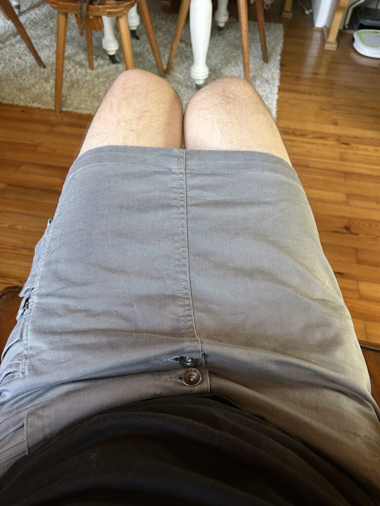
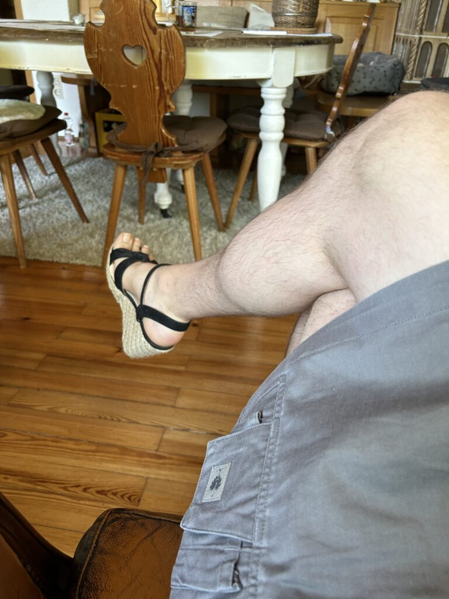
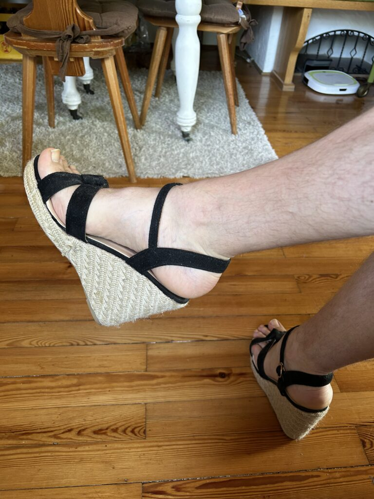

At the end of May, I wrote [a short post](https://www.the-beskirted-man.com/general/visitors-2025/) that mentioned we were receiving visitors from the Southern United States who are not exactly what you would call tolerant towards any sort of deviation from their norm. To keep the peace within the family, I decided not to wear skirts or heels around them for the duration of their nearly three-week visit, and I have to say, it has been difficult.

As you may be able to tell from the fact that I started this blog, I am really passionate about wearing gender-non-conforming clothes. I love the way they make me feel since I feel so much more like myself than when wearing jeans. That has made these past weeks tough, but at the same time, it gives me a fresh opportunity to appreciate and enjoy putting on a skirt again. When you wear them every day, you get used to them, and putting on a skirt simply becomes part of your normal routine. As such, the distance is sometimes nice to have.

While I didn’t wear any skirts when they were present, I did take the opportunity to [wear a gray skirt and heeled sandals](https://mastodon.social/@alexseifert/114680443425849412) while they were off traveling for a couple of days (see the photos below). The first time putting them on in weeks felt like coming home after a long time away.

<figure></figure>

<figure></figure>

<figure></figure>

A Surprise
----------

Something surprising did happen, however. Among the visitors was my cousin’s seventeen-year-old daughter. We had plenty of opportunity to talk about all sorts of things because she was the only one who was genuinely interested in history and culture. As such, I took her to see castles, palaces, Roman ruins, and museums. The others went to see some of them, but were much less interested in the actual history. I am a huge history nerd, so I relished the opportunity to show and tell her everything I know.

At some point, we got to talking about her starting university this coming fall and one of the things she mentioned she was looking forward to was more diversity. She said she was bored in the small town she had grown up in and with the fact that everyone acts and thinks the same way. It turns out that she has actually had a lot of trouble making friends because she tends to have much more liberal views in a deeply conservative town. She is also the first one in her branch of the family to go to a university. Most of them barely made it through high school or ended up with [GEDs](https://en.wikipedia.org/wiki/General_Educational_Development), so education clearly isn’t a priority for that part of my extended family.

While we were visiting the [Alte Pinakothek art museum](https://www.pinakothek.de/en/alte-pinakothek) in Munich, we [saw two men in skirts](https://mastodon.social/@alexseifert/114660954197532440). One was wearing a blue denim maxi skirt with red and black flannel patches that looked rather punk and the other was wearing a black pleated midi skirt that was somewhat reminiscent of what we’ve been seeing on runways. We saw them wandering around at different times and they didn’t appear to be together or even aware of each other. These men wearing skirts didn’t escape her notice.

After seeing the second one in the black pleated skirt, she asked if I had seen them. I confirmed that I had and her next question was whether that was normal in Germany. I replied honestly and told her it was not mainstream, but that I’ve seen more and more men wear them over the past couple of years. I also told her I even know some men who wear skirts here and that I also have some skirts at home that I wear.

Needless to say, she was surprised. Her surprise only lasted for a fleeting moment, though, before she got excited and said that she wanted to see me wear one. She then asked me about the details: how many I have, what styles I wear, etc. I answered her questions and ended up showing her some of the pictures I’ve posted of myself wearing them. She now follows me on [Instagram](https://www.instagram.com/thebeskirtedman/).

A couple of days later, when we were back at home, she stayed home with me and my wife while the others went out for the afternoon. I used that opportunity to show her my skirts and even model a couple of them for her. She got excited about it and said that she hopes there will be men who wear skirts at her university. I told her it’s unfortunately unlikely since she is going to university in a deep red, southern state. She seemed disappointed, so I told her she should start spreading the idea amongst any boys she might meet there. She agreed that she should.

The skirt-wearing didn’t last long, unfortunately, as we all agreed that it would be best if her parents didn’t see me wearing them or know about it at all. So, back into the closet they went.

Conclusion
----------

It’s really sad that some people are so closed-minded that they cannot accept other people deviating from what they consider normal. It is maliciously controlling, willfully ignorant, and hopelessly limiting. The worst part about it is that they don’t understand or even care to know about what they are missing out on.

Fortunately, there are little beacons of hope that pop up every once in a while in the fog of bigotry. I would consider my cousin’s daughter one of them. She is bright, open-minded, intellectual and interested in anything that isn’t what her parents would consider normal. Of course, it might also just be teenage rebellion, but given how much culture and history she greedily absorbed while she was here and her genuine excitement about me and the other men wearing skirts, I think it runs deeper than that.

Most importantly, she now knows she has an ally in the family whom she can talk to about her nerdy interests as well as about topics that are not part of what her parents would consider normal. Hopefully, as a result, she feels less alone with her interests.