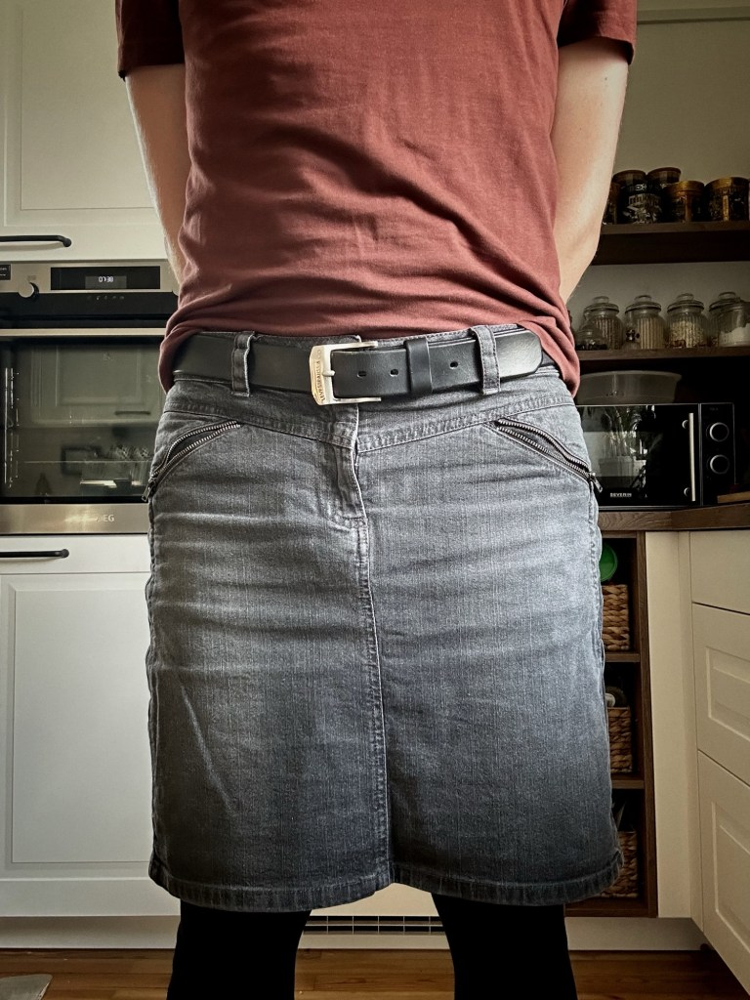

A couple of weeks ago, I had an interesting experience when I was riding the train home from Regensburg. I was wearing my gray denim skirt as can be seen in the photo below taken at an earlier date. I wore it with black cotton leggings, a pair of Converse-like dark gray and white sneakers and a black long-sleeved shirt.

The train was fairly crowded and as such, I was stuck standing rather than being able to sit down. In the area where I was standing, there were a number of other people, mainly men, standing there as well. Most of them had their eyes glued down to their phones and I believe I was the only exception as I was reading a book made of actual paper which is, hilariously, something older people have commented on before on the train.

In any case, as I was standing there reading my book, a woman in what I would guess is her mid-to-late 20s boarded the train. She made her way through the people standing there and I assume went to look for a seat. After a while, she came back unsuccessfully and, working her way through the crowd of men standing there, stopped and stood right next to me. It obviously isn’t unusual for someone to stand right next to you in a crowded train, however, the fact that she struck up a conversation was, indeed, unusual.

She started complaining about the crowded train and having to stand because it makes her feel uncomfortable with all the men standing around. She said so many of them just openly stare at her and that she’s been groped or touched inappropriately more times than she cares to admit. At first, I didn’t really know how to respond other than a typical, “Oh, I’m sorry to hear that” because that is not something that you normally hear from a complete stranger on the train. I then asked her if she often takes crowded trains to which she replied that she takes them daily because she has to commute during rush hour.

While I’m leaving out the details of our conversation, I am recalling the points that are important for what really stuck out to me in it. She mentioned that the reason she started talking to me was because I was wearing a skirt which made me feel less threatening and more approachable. She also said that she normally doesn’t strike up conversations with anyone on the train but felt like she could and even should talk to me and mention how the fact that I was wearing a skirt made her feel more comfortable. She even thanked me for it which I found rather odd.

In fact, the whole situation was odd. I could feel that she genuinely meant it and it seemed like me being there as a man wearing a skirt made her feel more at ease with having to stand in a crowded train full of men. Of course, we got on the topic of gender and clothes and she was fully on board with the idea that clothes don’t have a gender. We chatted for about twenty minutes before she got off at her stop and it was quite a pleasant conversation.

That is one of the rare instances where someone has commented on me wearing a skirt in public. As I have written before, the few comments I have received have been entirely positive except for [one instance](https://www.the-beskirted-man.com/personal-experiences/my-only-negative-experience-in-a-skirt-in-public/).

I find it unbelievably sad that a woman like her has to feel uncomfortable standing in a crowded train because men can’t or don’t want to control themselves. Toxic masculinity is a poison that affects every gender, and I really do feel for someone like her. Fortunately, there is a growing movement against it right now, and I am immensely proud to be a part of that — especially if it makes a difference, no matter how small, to someone who normally feels threatened by it.

<figure><figcaption>One of my gray denim skirts</figcaption></figure>