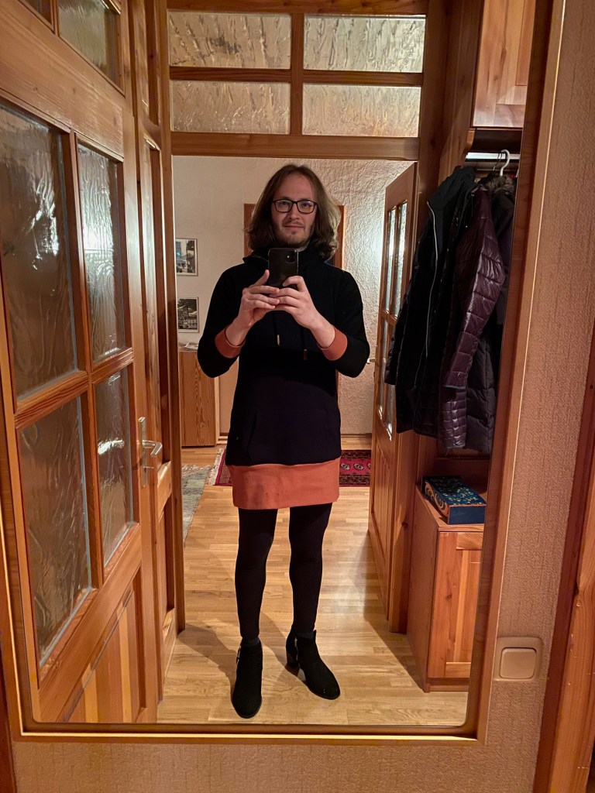

Since starting this blog, I have heard from a number of men whose interest in wearing skirts and other clothing typically found in the women’s department has led to them questioning their gender. This is also something I went through and it almost cost me my marriage. As such, it is somewhat of a sensitive topic that I wasn’t sure I even wanted to write about.

However, I decided to post about my experience anyway, with the hope that it might help someone else who is going through the same or a similar situation. My conclusions about my gender may be different than yours and I in no way want to delegitimize anyone who comes to a different conclusion than I have.

The Start of a Wild Ride
------------------------

It all started during the Corona lockdowns here in Germany. I had stopped going into the office every day and was stuck at home like the rest of the world. That time was both a great time and a terrible time. It was great because it gave me the freedom to explore who I am and, frankly, I wouldn’t be where I am wearing skirts without having had that time. This blog probably wouldn’t even exist.

It was also terrible, though, for a number of reasons that will sound familiar to a lot of you. It led to depression and burnout for me. The band I had been playing in for years and that had been such an important part of my life dissolved in a not-so-friendly manner which meant I also lost friends. I was used to a lot of social contact and it suddenly disappearing was relaxing at first, but I quickly missed it.

In the middle of it, my wife and I bought a house and moved. Financially speaking, it was the perfect time to buy property with historically low interest rates and financial incentives from the government, but it also meant we moved far away from my wife’s hometown of Munich. We left all of our friends and her family behind which also contributed to the feeling of isolation and ultimately, to burnout.

During Corona, we were also confronted with the deaths of a number of older family members on both sides, some of whom we were very close to. None of them were because of Corona directly, but I suspect the lockdown and even deeper isolation led to a rapid decline of their already frail health.

The reason I am talking about all of this is that it played a vital role in my identity crisis. After all of the loss, I felt like I didn’t know who I was anymore. My life had fallen apart and I turned inwards to try to heal the damage it had done.

I’ve mentioned before that I’ve been interested in wearing skirts, dresses and heels for decades. Even before Corona, I was regularly wearing skirts and heels at home, although not nearly as often as I do now and never in public. In a way, they became a sort of shield for me against the outside world. You might even call it a rebellion against everything that had happened in my life outside of my control.

Not conforming to gender norms brought back a sense of control over my life that I felt was sorely lacking. It made me feel like I could still do whatever I wanted and no one could stop me despite the greater circumstances.

While lockdown was still in place, this wasn’t a problem. I rarely went out in public because there wasn’t a reason to which meant I could indulge in my interest as much as I wanted without fear of judgement — at least after [my wife came to terms](https://www.the-beskirted-man.com/julias-perspective/help-my-husband-likes-wearing-skirts-and-heels/) with my new choice of fashion.

Things changed once the lockdown was lifted, however. I didn’t have the confidence to wear any of it in public yet, but was desperate to get out. At the same time, my gender-non-conformity had already become such an important part of my identity that I didn’t want to give it up just to go out. I was conflicted.

[Building the confidence](https://www.the-beskirted-man.com/in-public/building-up-the-courage-to-go-out-in-public/) to go out in a skirt and heels as a man is not an easy feat. In fact, it was so difficult for me that I felt like transitioning and being seen as a woman just so I could wear what I wanted in public would be the easier way out. Now it seems silly, but at the time, it was serious.

What Questioning Your Gender Means
----------------------------------

Anyone who has ever experienced gender dysphoria knows how serious a mental condition it is. For those that haven’t, picture having depression and burnout at the same time along with loathing your very existence just because you were assigned a gender at birth that doesn’t match what you feel. You feel like you shouldn’t exist the way you do.

I’m not saying that everyone who has experienced it has had the same experience I had, but that was how I felt. I also used occurrences and thoughts from my youth to justify thinking I might be trans. For example, there were plenty of times as a teenager that I would dream of waking up as one of the female characters in the games I liked to play. Of course, there was also [the black dress in my closet](https://www.the-beskirted-man.com/skirts-and-dresses/the-dress-in-the-closet/) that I loved to wear in secret as a teenager, as well as the fact that I had started wearing skirts and stockings a lot in college. Another thought I had was that almost all of my friends throughout my life had been female as I had always gotten along with them better than boys. I had always felt that I fit in with the girls better.

This had a number of consequences. I started by growing my hair out so that it was well past my shoulders (see the picture below). I did a lot of research on HRT (hormone replacement therapy) and what is necessary to do here in Germany in order to get it. I even went to a trans support group for several months.

A Crisis
--------

Meanwhile, I kept most of this a secret from my wife: not a good idea. Of course, she could see that I was growing my hair out and primarily wearing clothes from the women’s department, but she didn’t know the depth of what was going on in me. I didn’t dare tell her at first because I knew that would be the end of our marriage. And it nearly was.

After talking to the support group about my dilemma, I came to the conclusion that I had to tell my wife sooner rather than later. The group had met in the afternoon and I broached the topic with her that evening. Needless to say, it ended in a lot of tears. She outright rejected it, saying that she married a man and not a woman, which, to be fair, is understandable.

By that time, she was already pregnant with our son which made the issue much worse. Once she had calmed down after the initial shock, she said we would have to get a divorce if I continued down that course, but that we could remain close friends as women.

The Aftermath
-------------

That didn’t sit right with me. I didn’t want to lose my marriage or sacrifice that growing family I was looking forward to. I regret putting her and myself through that trauma, but her reaction was just the shock I needed to get myself back together. We had several long discussions about it in the following days that made me realize that what I was experiencing wasn’t true gender dysphoria, but rather a deep-seated depression.

At that point, I sought professional help. The therapist was versed in both depression/burnout as well as gender dysphoria which was exactly what I needed. Over the course of many sessions, we worked out that I was just using gender-non-conformity as a tool to take back the control over my life that had been ripped away from me through Corona and its consequences. Through isolation, the loss of loved ones, the loss of friends, the loss of my band, the move to a new area, etc, I had experienced such a huge amount of loss that it was no wonder I was in such a terrible mental state.

Conclusion
----------

The interest in skirts, heels, dresses and women’s clothing in general has always been there, even before I knew that the concept of gender dysphoria existed. Rebelling against gender norms has always been a part of who I am, but that doesn’t necessarily mean I was assigned the wrong gender at birth.

In fact, rebelling against norms I consider to be superfluous is a deep-seated part of who I am. As a teenager, I went through a goth phase, a punk phase and a metal-head phase, which I never entirely got out of. All of these have one thing in common: rebellion against the norm and pushing boundaries. While they are generally more accepted by the mainstream than rebelling against gender norms, they were still an important part of my identity at the time.

And that is how I feel about my gender-non-conformity now. I will never be satisfied living according to the arbitrary rules set out by society and my skirt-wearing is its current manifestation. My interest in it was always there, but this experience gave me the confidence and space to fully live it. It was an exceedingly difficult time, but I managed to come out stronger on the other side.

Since those therapy sessions, any feelings of gender dysphoria have entirely disappeared. If I were truly trans, it wouldn’t be that easy to get rid of them, as I have heard not only from the therapist, but also from transgender friends I have.

In the end, I am happy as a man who doesn’t fit the manly man stereotypes that I’ve always disliked and never felt a part of. I will keep rocking the skirts and heels as a man proud to break out of the confines of gender stereotypes.

<figure><figcaption>Going through a phase of questioning my gender</figcaption></figure>

*Have you ever questioned your gender because of your choice of clothing? Do you know anyone else who has? Have you ever questioned your gender for other reasons? Let me know about your experiences in the comments!*