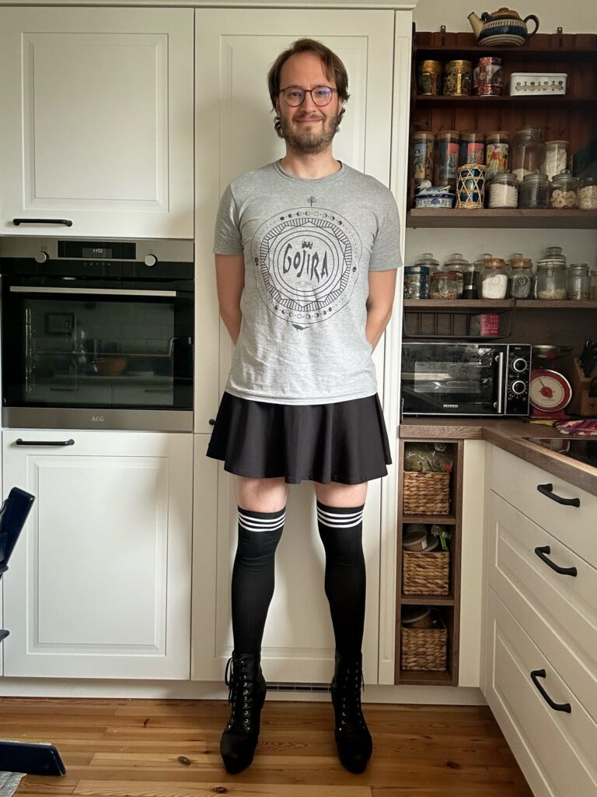
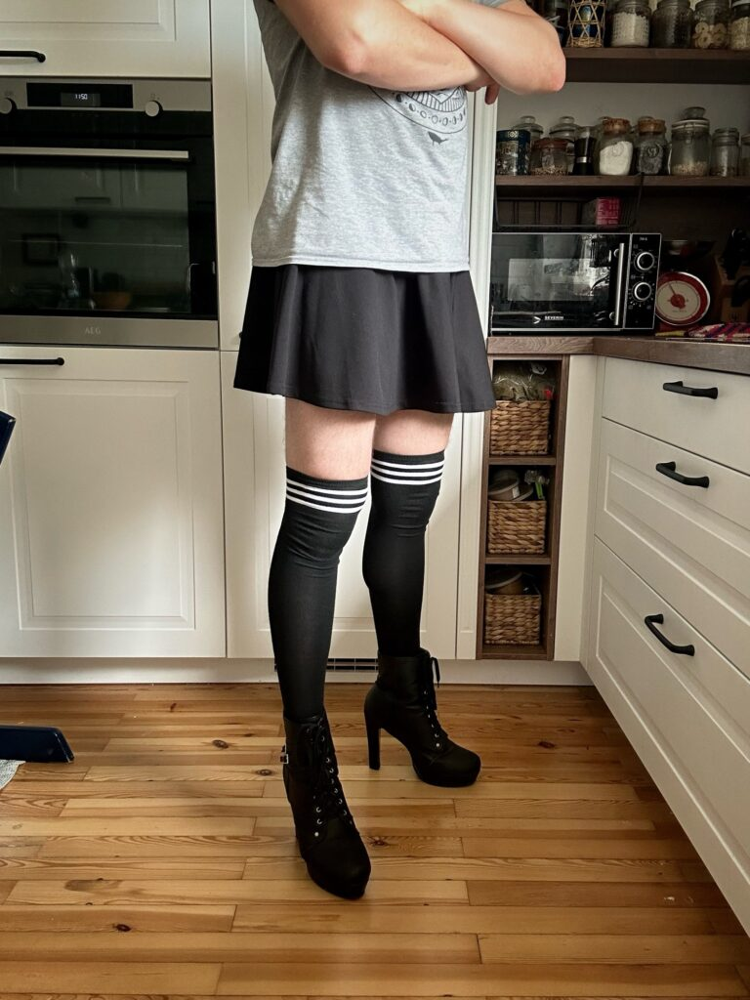
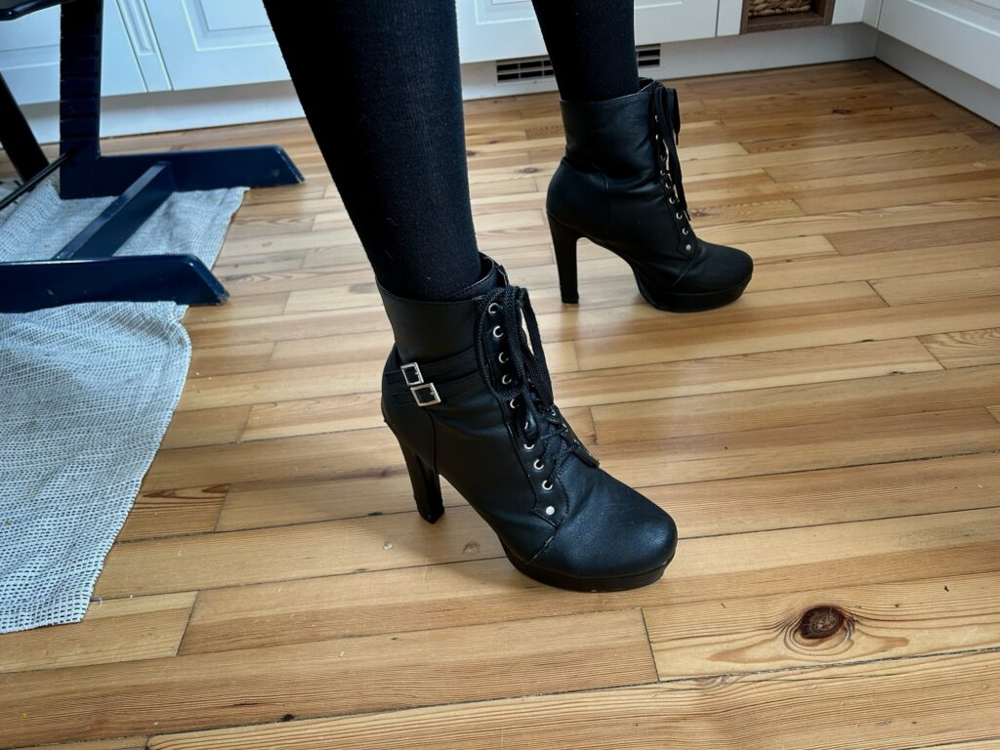
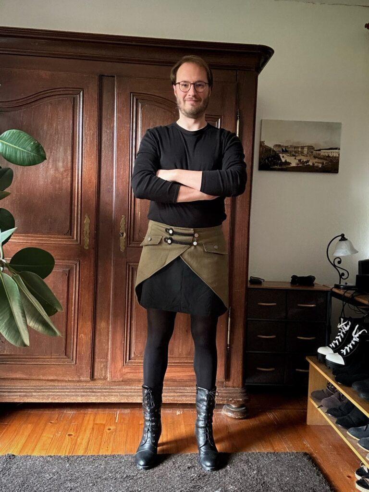
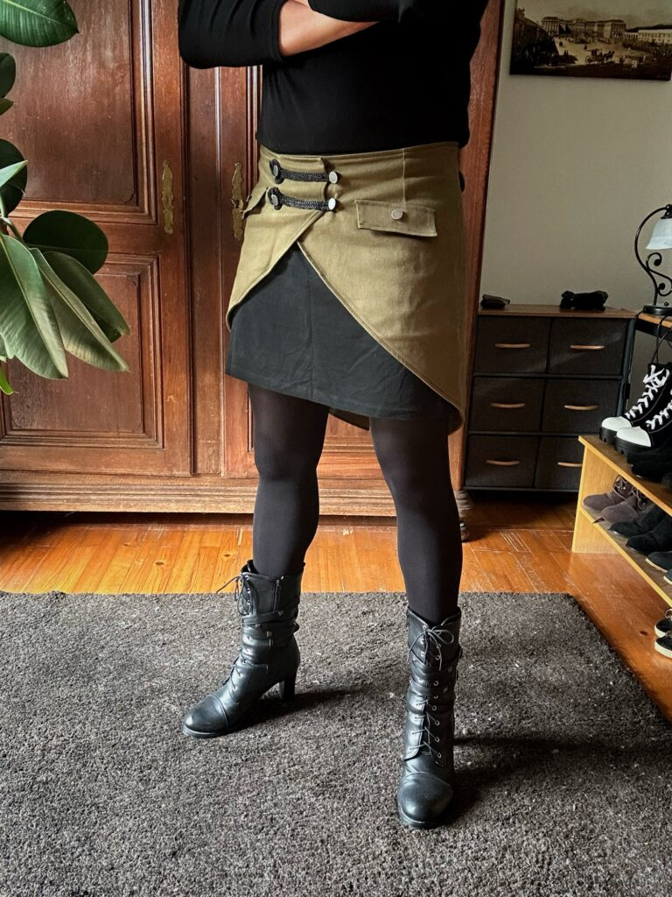
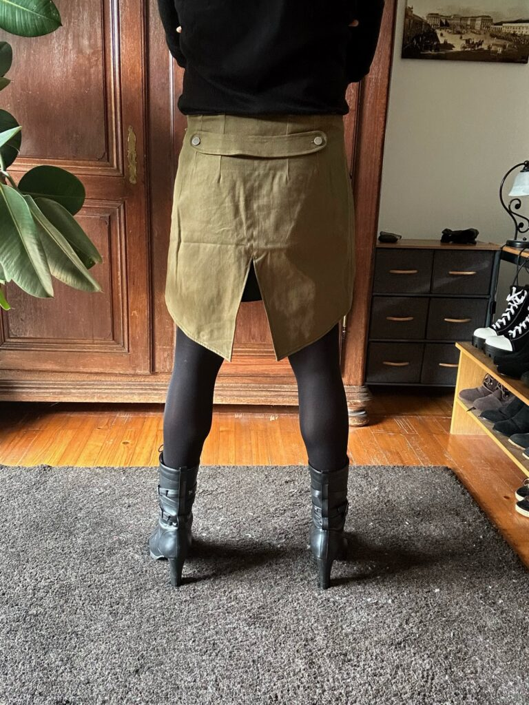
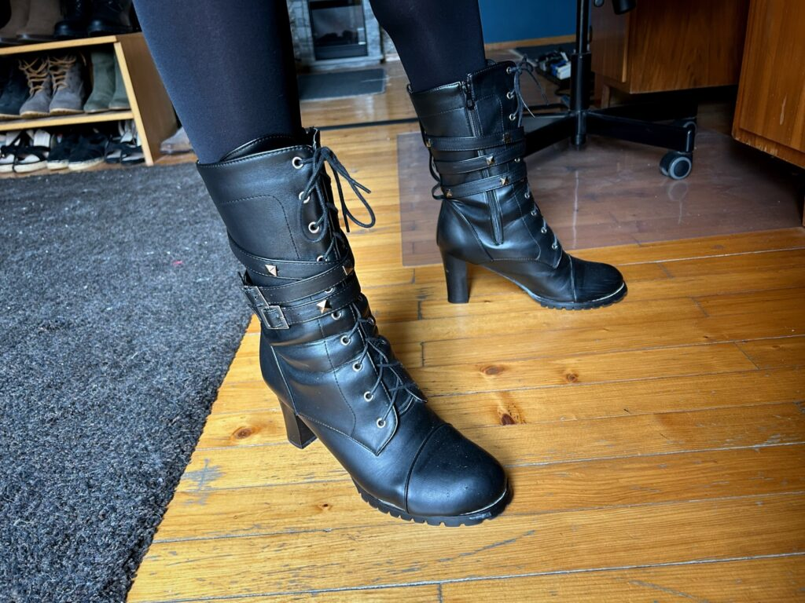

I’ve decided to try something new on the blog called “Week Notes.” The [idea behind it](https://gilest.org/doingweeknotes/index.html) is to write a post at the end of each week reflecting on how it went and what I did. My posts will primarily be focused on what happened during the week concerning skirts, heels and other gender-non-conforming clothing. I will also use them to more regularly post photos of my outfits on the blog rather than just on social media.

So, what happened this week? Well, not a whole lot actually. As usual, I wore skirts most days. I haven’t been taking and posting photos of my outfits as often, however, due to a lack of time and the feeling that I haven’t been particularly creative with them recently, making the photos feel a bit repetitive. As such, I don’t have a whole lot of photos to share for this week’s post.

Other than that, I took my first foray into women’s jeans. I bought my first pair from Only and wore them on Tuesday. I can’t say I’m going to continue to buy women’s jeans, however, because other than not having front pockets, they weren’t significantly different from men’s skinny jeans, which is the style I tend to wear anyway. Since I’d rather have the front pockets, I’ll stick with men’s jeans if I happen to feel like wearing pants instead of a skirt.

Another small, yet perhaps noteworthy, occurrence this past week happened on Friday. I wore my [black skirt from Engelbert-Strauss](https://www.strauss.com/de/en/womens-tabards-aprons/skirt-e-s-motion-ten-ladies-3161420-66206-1200.html) with black cotton leggings to pick up my son from daycare. One of the moms I see there every day, and who has seen me wearing skirts many times before, commented on it for the first time. She mentioned that she didn’t know that Engelbert-Strauss made skirts and that she’d have to look into getting one herself. She wanted to know where I got it and said she thought it looked good on me. Then she added a side comment to the effect of: “But then again, all the skirts you’ve worn have looked good on you.” Compliments like that really make my day.

My son also said the word “skirt” for the first time. He repeated it by stating matter-of-factly when touching the skirt I was wearing that it was “Papa’s skirt.” Then he ran off and played, nothing out of the ordinary. Little kids really prove the point that it’s socialization that creates gender restrictions rather than “the natural order of things” as I’ve heard some commentators call it.

The photos below were from the week before last rather than from this past week, but I figured I would post them anyway because they are some of the more interesting outfits I’ve worn in a while.

<figure></figure>

<figure></figure>

<figure></figure>

<figure></figure>

<figure></figure>

<figure></figure>

<figure></figure>