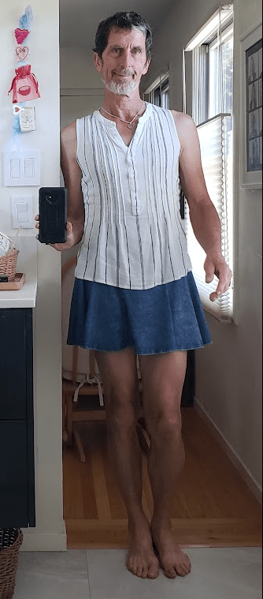

I love hearing other people’s takes on wearing gender-non-conforming clothing and hearing about their experiences. This is another great writeup of a man’s experiences wearing dresses and other gender-non-conforming clothing.

What should I do when people are uncomfortable seeing me in a dress?

I used to just ignore it. I was making a point \[gender freedom\] in a take it or leave it fashion. Today, I am more sympathetic. I have come…

[https://therealphil.medium.com/what-should-i-do-when-people-are-uncomfortable-seeing-me-in-a-dress-31fc1158a5b2](https://therealphil.medium.com/what-should-i-do-when-people-are-uncomfortable-seeing-me-in-a-dress-31fc1158a5b2)