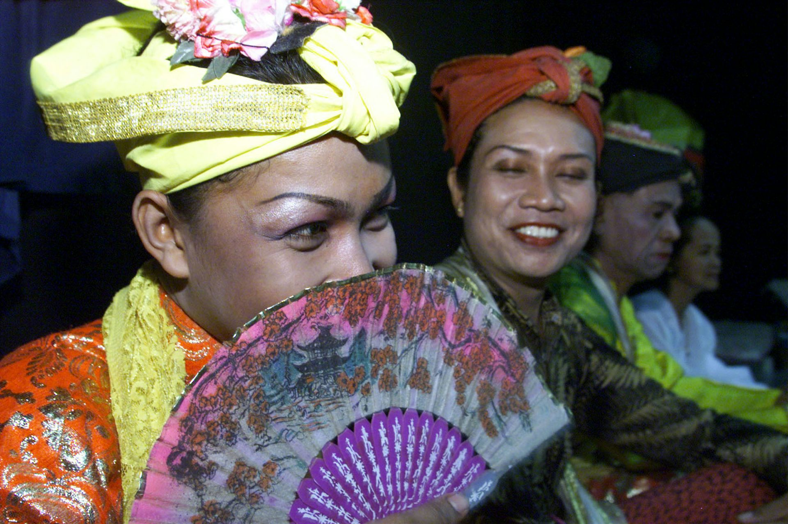

This is a fascinating look at how Indonesians view gender in their culture and how it differs to the stiff intolerances of the western world.

What we can learn from an Indonesian ethnicity that recognizes five genders

Is our gender determined by our bodies or our culture?

[https://theconversation.com/what-we-can-learn-from-an-indonesian-ethnicity-that-recognizes-five-genders-60775](https://theconversation.com/what-we-can-learn-from-an-indonesian-ethnicity-that-recognizes-five-genders-60775)