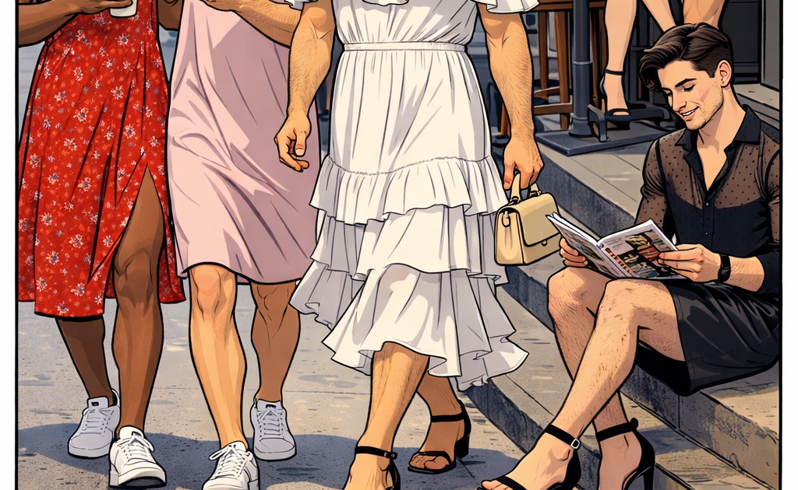

It’s been a while since the last “In The Media” post, but I’m extremely happy to be able to post another find of mine.

This blog is generally about men crossdressing trying to pass as women, but it also has some interesting general posts about men wearing women’s clothing. I especially liked this recent post about a “discussion” the author had with AI about what the world would look like if men wearing what are currently popularly considered women’s clothes became just as commonplace as women wearing men’s.

There are certainly some interesting points made.

When Men Dressing Like Women Stops Matter­ing

I asked an AI to explore what society would be like if men could wear womenswear as freely as women wear menswear today. Here is its respons…

[http://www.femulate.org/2026/03/when-men-dressing-like-women-stops.html](http://www.femulate.org/2026/03/when-men-dressing-like-women-stops.html)