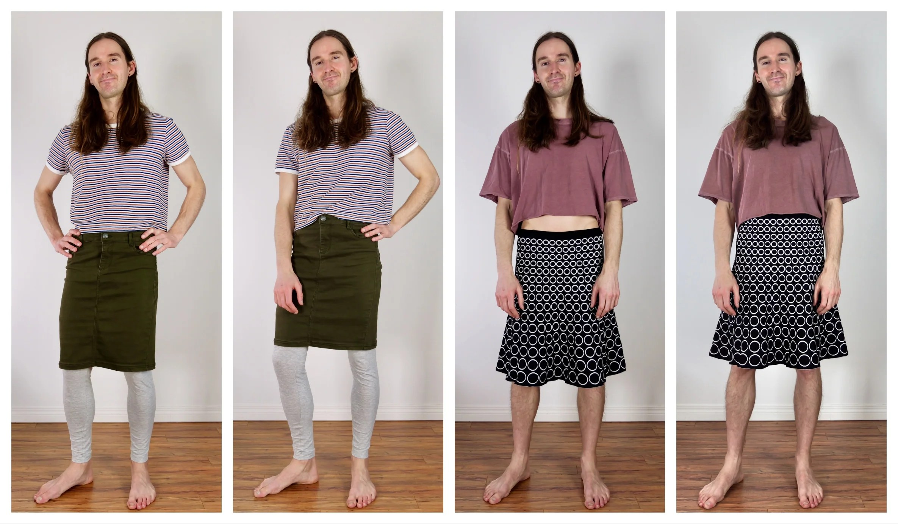

Everybody Skirts has done it again! This is another great article about where your waistline is when wearing a skirt.

Men are so used to wearing pants that tend to be lower on the hip that is an adjustment to wear skirts higher. This was certainly something I did at the beginning because I had no idea. Since I mostly wear my shirts untucked, it took quite a while before my wife could see how low I was wearing my skirts and correct me.

Obviously, where you wear them is entirely up to you and depends on what you feel most comfortable with, but this article should help guide you to find your sweet spot.

Where’s My Waistline? Tips for the Skirted Male

I sat down to write this style tip thinking that the recommendation would be ‘Your waistline is at the navel, not the top of your butt’. For most skirts and traditional kilts, this might be true. But for many skirts, it depends. Why Wear Skirts High? Your legs will look longer. The male bulge can be less noticeable und

[https://everybodyskirts.com/blogs/posts/wheres-my-waistline-tips-for-the-skirted-male](https://everybodyskirts.com/blogs/posts/wheres-my-waistline-tips-for-the-skirted-male)