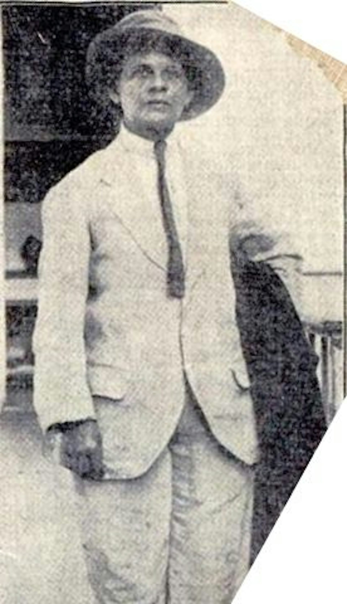

This ten-year-old article is from one of my favorite websites to read: [The Conversation](https://theconversation.com). The article might be a decade old but I still think it’s relevant to the situation of men in skirts today. While things are slowly changing, men wearing skirts is, unfortunately, still a rarity, and the reasons as to why they don’t have changed in the past ten years either.

Why don’t more men wear skirts?

Two weeks ago, the bi-annual runway collections got off to a cracking start with the display of the Men’s Collections in Milan, Paris, London, New York and Pitti Uomo. (You will be entirely unsurprised…

[https://theconversation.com/why-dont-more-men-wear-skirts-21899](https://theconversation.com/why-dont-more-men-wear-skirts-21899)